# 20 · Bản đồ vận hành — fleet operation visualizer (`kami/replay`, `web/`)

> Sprint 03 (UI-1 phần bản đồ + metric ở chế độ phát lại, MAP-2 phần hiển thị). Plan:
> [sprint-03-plan.md](../implementation-plan/sprint-03-plan.md).

Visualizer phát lại một lần chạy engine trên bản đồ thật trong trình duyệt: xe chạy theo đường của mạng, để lại vệt
màu theo trạng thái, kèm KPI và biểu đồ chạy theo đồng hồ mô phỏng. Ba phần nối với nhau bằng một **hợp đồng dữ liệu**
có phiên bản:

```
 engine (record_trajectories, timeseries)          kami.replay (Python, thư viện chuẩn)          web/ (Next.js)
 ┌──────────────────────────────┐   chặng, log,   ┌──────────────────────────────────┐  thư mục  ┌──────────────────────────┐
 │ Simulation.run()             │──metric rows──▶│ dòng thời gian trạng thái từng xe │─────────▶│ Mapbox GL + deck.gl      │
 │  sim.trajectories (S02-6)    │                 │ giản lược điểm (≤ 1 m, ≤ 0,5 s)    │ manifest  │ ECharts, panel, phát lại │
 │  sim.log, sim.timeseries     │                 │ ghi JSON(.gz) xác định, validate()│ + 4 file  │ (chỉ đọc file tĩnh)      │
 └──────────────────────────────┘                 └──────────────────────────────────┘           └──────────────────────────┘
```

`kami.replay` không thuộc lõi engine: `import kami` không nạp nó, nó không import thư viện web/DB nào (NFR-5, có test
trong `tests/test_isolation.py`). Bộ đọc bản đồ hiện vẫn đọc fixture; Sprint 09 A đã ghép trang vào ứng dụng quản lý,
backend 08 B sẽ cung cấp API replay sau khi hợp đồng Sprint 04 ổn định.

## 1. Hợp đồng dữ liệu `kami.replay` v1

Một thư mục; mỗi file trừ manifest có thể nén gzip (`<tên>.json.gz`, mặc định). Thời gian là **giây kể từ 0h** của
ngày kịch bản (7h = `25200`), làm tròn 0,1 s; toạ độ `lon, lat` WGS84 làm tròn 6 chữ số (~0,1 m) — mạng không có
lon/lat (lưới synthetic) ghi `x, y` mét (2 chữ số) và `manifest.coords = "xy"`.

| File | Nội dung |
|---|---|
| `manifest.json` | `schema_version` (1), `kind` (`"kami.replay"`), `kami_version`; `run` (`name`, `scenario`, `seed`, `crn_seed`, `policy`, `network`, `spec_sha256` — sha256 của RunSpec đã giải, dạng JSON khoá sắp xếp); `coords`; `area` (`name`, `bbox` [lon0, lat0, lon1, lat1], `center`, `zoom` gợi ý) — khu vực của kịch bản (`zonal.area`) hoặc khung dữ liệu; `bounds` (khung mọi điểm); `time` (`start`, `end` — từ lúc xe đầu tiên online tới lúc xe cuối cùng offline; `scenario_start`); `states` (`[{id, label, color}]`, `color` là khoá token `state.<id>`); `fleets` (`{tên: số xe}`); `counts` (`vehicles`, `segments`, `points`, `events`, `metric_rows`); `files` (`{vehicles\|trips\|events\|metrics: {path, sha256, bytes, raw_bytes}}`); `simplify` (`dist_m`, `dt_s`) |
| `vehicles.json` | `[{id, fleet, vehicle_type, group, seats, shift: [t0, t1]}]` — `shift` là khoảng xe có mặt trong replay |
| `trips.json` | Các **segment** theo cột, sắp theo (xe, `t0`): `vehicle`, `state`, `rider` (khách của chặng, `null` nếu không có), `t0`, `t1`, `dist_m` (độ dài polyline gốc trước giản lược), `path` (mỗi segment một mảng phẳng `[lon0, lat0, lon1, lat1, …]`), `ts` (thời điểm từng điểm, `len(ts) = len(path) / 2`). Segment đứng yên có một điểm |
| `events.json` | Sự kiện của khách theo cột: `t`, `type` (`request`, `booked`, `declined`, `matched`, `pickup`, `dropoff`, `cancel`), `rider`, `vehicle`, `lon`/`lat` (điểm đón; `dropoff`: điểm trả), `to_lon`/`to_lat` (điểm đến của `request`, còn lại `null`), `eta` (`matched`: giờ đón đã hứa, tuyệt đối) |
| `metrics.json` | `{interval_s, t: [...], series: {tên cột: [...]}}` — **đúng** các dòng của `sim.timeseries` (docs/engine/18 §2), NaN → `null` |

**Tương thích.** Bên đọc bỏ qua trường lạ. Thêm trường, thêm trạng thái (ví dụ `to_charger`, `charging` ở Sprint 05 —
khai báo trong `manifest.states`) hoặc thêm fleet **không** tăng `schema_version`; đổi nghĩa một trường thì tăng.
`validate` và web từ chối phiên bản lớn hơn với thông báo rõ ràng.

### Trạng thái xe

| `id` | Nhãn | Nguồn (dòng thời gian của engine) |
|---|---|---|
| `idle` | Rảnh – đứng yên | Khoảng hở giữa hai chặng khi không có khách trên xe; từ lúc online tới chặng đầu; sau chặng cuối tới lúc offline |
| `cruising` | Rảnh – đang chạy | Chặng `purpose = "idle"` (`IdleMoveModel` cho xe tự đi) |
| `pickup` | Đi đón khách | Chặng `stop` không có khách trên xe (từ `TRIP_ACCEPTED`) |
| `on_trip` | Chở khách | Chặng `stop` có khách; khoảng khách lên xe (`boarding_s`, từ `PICKUP` tới lúc xuất phát) |
| `reposition` | Điều xe | Chặng `purpose = "reposition"` (policy điều xe rảnh) |

Khách xuống xe (`DROPOFF`) hoặc hủy khi xe đang tới (`RIDER_CANCEL` pha `matched`) → xe về `idle` ngay, đúng như
engine. Chặng độ dài 0 (xe đã đứng ở điểm đón) hoặc bị cắt trước giờ xuất phát không có chuyển động: nó chỉ kết thúc
khoảng hở trước nó. Một nguồn sự thật (Python), trình duyệt chỉ tra cứu (quyết định D5).

### Giản lược điểm (quyết định D6)

Polyline của chặng (theo `edge_geometry`, Sprint 02) có nhiều điểm thẳng hàng. Trình duyệt nội suy tuyến tính theo
**cả** vị trí lẫn thời gian, nên `kami.replay.simplify` chỉ bỏ điểm `k` (giữa hai điểm giữ `i`, `j`) khi khoảng cách
tới dây cung `i→j` ≤ `dist_m` (1 m) **và** thời điểm dây cung đi qua hình chiếu của nó lệch `t_k` ≤ `dt_s` (0,5 s);
tách theo điểm tệ nhất kiểu Douglas–Peucker. Điểm đầu/cuối luôn giữ; điểm giữ là điểm của polyline gốc nên luôn nằm
trên đường. Có test đo độ lệch lớn nhất (≤ 1 m, ≤ 0,5 s) và khoảng cách mọi điểm xuất ra tới polyline gốc (≤ 1,5 m).

### Xác định (NFR-1)

JSON khoá sắp xếp, số làm tròn cố định, gzip `mtime = 0` không tên file, không ghi thời điểm tạo: **cùng cấu hình +
seed → cùng byte** (manifest ghi sha256 từng file). `validate(path) → list lỗi` (thư viện chuẩn) kiểm tra: đủ file,
sha256 khớp, `schema_version` hỗ trợ, cột cùng độ dài, thời gian không giảm trong segment, segment kề nhau của một xe
nối tiếp (bắt đầu không sớm hơn segment trước kết thúc, điểm đầu = điểm cuối trước), segment sắp theo xe, trạng thái
có trong `manifest.states`, toạ độ trong `bounds`, loại sự kiện hợp lệ, cột metric đủ dòng.

### API Python

```python
from kami.replay import export, validate, load, tables, from_simulation
from kami.replay.query import ReplayIndex

sim = Simulation(sc, config=SimConfig(record_trajectories=True, timeseries_interval_s=60)).run()
out = export(sim, "out/replay", area={"name": "Hoàn Kiếm", "bbox": [105.84, 21.02, 105.86, 21.04]})
assert validate(out) == []
idx = ReplayIndex(load(out)["trips"])
idx.state_at(vehicle_id, 28_800.0), idx.position_at(vehicle_id, 28_800.0)   # quy tắc tham chiếu của web
```

`export` nhận một `Simulation` đã chạy (cần quỹ đạo và event log) hoặc một `ReplayInput` (ví dụ dựng từ thư mục run:
`kami.replay.cli.from_run_folder`). Trong RunSpec: `"outputs": {"replay": "json"}` → `run --spec --out` ghi
`<out>/replay/`, `run --db` lưu artifact `replay` (docs/engine/18).

## 2. Fixture demo (`python -m kami replay demo`)

Kịch bản `scenarios/hanoi/demo_center.json` (quyết định D7): khu vực **Hoàn Kiếm, Ba Đình, Đống Đa, Hai Bà Trưng**
(`zonal.area.bbox` = [105,80, 20,995, 105,87, 21,050]), **7h00–9h00** (cao điểm sáng), **300 xe** (200 ô tô + 100 xe
máy), tắc đường zone × giờ, seed 0, chuỗi metric mỗi **60 s**, `drain_s` 1.800 s. Request và vị trí đầu ca nằm trong
khu vực; xe vẫn chạy trên toàn mạng.

| Chỉ số (seed 0) | Giá trị |
|---|---|
| Request / đã đặt / hoàn thành / hủy | 2.897 / 2.297 / 1.928 / 368 (hoàn thành ÷ đã đặt = 0,84) |
| Segment / điểm / sự kiện | 8.361 / 136.112 / 12.017 |
| Dung lượng (gzip) | 1,14 MB: `trips` 0,99 · `events` 0,13 · `metrics` 0,01 · `vehicles` < 0,01 (chưa nén 5,0 MB) |
| Thời gian sinh | ≈ 15 s (mô phỏng 10 s + xuất 5 s; router C++) |

Fixture được **commit** ở `web/public/fixtures/hanoi_center_demo/` để mở web không cần build mạng Hà Nội (D8). Cần
mạng `hanoi` (`python -m kami.osm build hanoi`, docs/engine/19) để sinh lại; chạy hai lần cho file giống hệt, và giống
file trong repo (`tests/test_replay.py::TestDemoFixture`, tự bỏ qua khi chưa build mạng). Mọi thay đổi engine làm đổi
kết quả demo thì phải chạy lại lệnh và commit fixture mới.

## 3. Ứng dụng web (`web/`)

Next.js 16 (App Router, build tĩnh `output: "export"`, không backend) + React 19 + TypeScript; bản đồ **Mapbox GL JS
v3** với lớp **deck.gl 9** (`MapboxOverlay`, canvas riêng — §3 "Cách hiển thị"); biểu đồ **Apache ECharts 6** (import theo module); state
**Zustand**; test **Vitest** (quyết định D1–D3; ECharts 6 là bản hiện hành lúc cài, cùng API module với 5).

### Chạy

```bash
cd web
cp .env.example .env.local          # điền token public Mapbox (pk.…), xem bên dưới
npm ci
npm run dev                         # http://localhost:3000
npm test                            # Vitest (dữ liệu, layer, tương phản màu)
npm run build                       # bản production cho Next.js server
npm start                           # cần server để proxy API (Sprint 09 A)
```

Node ≥ 20 (`web/.nvmrc`: 24). Phiên bản thư viện khoá trong `package-lock.json`.

**Mapbox token.** Đặt trong `web/.env.local` (đã có trong `.gitignore`, không commit): biến chuẩn
`NEXT_PUBLIC_MAPBOX_TOKEN`; `next.config.mjs` cũng nhận `MAPBOX_PUBLIC_TOKEN`, `MAPBOX_TOKEN`, `MAPBOX_ACCESS_TOKEN`
và đưa sang biến công khai lúc build. Dùng token **public** (`pk.`), nên giới hạn URL trong tài khoản Mapbox. Thiếu
token → trang hiện hướng dẫn cấu hình thay vì lỗi trắng (panel vẫn chạy).

**Tham số URL** (dùng cho demo, ảnh chụp, kiểm thử):

| Tham số | Ví dụ | Ý nghĩa |
|---|---|---|
| `replay` | `/fixtures/shared_v1_walkthrough` | Thư mục replay (mặc định demo toàn bộ vòng đời Shared); `/fixtures/hanoi_center_demo` giữ demo 300 xe cũ |
| `t` | `28800` | Thời điểm mô phỏng ban đầu (giây từ 0h) |
| `view` | `105.8455,21.0245,16,55,-20` | `lon,lat,zoom[,pitch[,bearing]]` thay cho căn khung khu vực |
| `mode` | `trajectories` | Chế độ quỹ đạo |
| `hide` | `on_trip,idle` | Ẩn trạng thái |
| `select` | `142` | Chọn xe (mã xe) |
| `od` | `1` | Bật cung OD |
| `panel` | `0` | Thu gọn bảng metric |
| `palette` | `B` | Bảng màu trạng thái (A mặc định) |
| `debug` | `1` | Bộ đo khung hình (§5) |
| `interleaved` | `1` | Vẽ lớp xe bên trong bản đồ (vệt dưới tên phố) — chỉ để so sánh, chậm hơn nhiều khi nghiêng (§3) |

### Màn hình

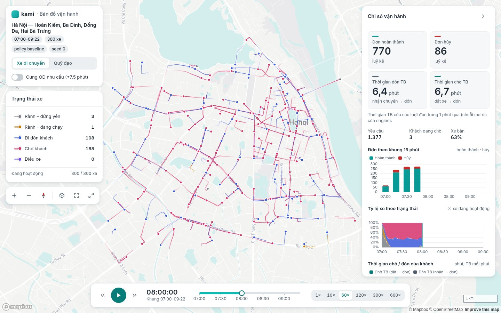

| Khối | Nội dung |
|---|---|
| Bản đồ (toàn màn hình) | Mapbox `light-v11` chỉnh lúc chạy (D11): nền `map-ground`, nước pha sắc Tiffany nhạt, ẩn POI/giao thông công cộng/nhãn phụ, tên phố xám nhạt, **không có khối nhà 3D**. Pan, zoom (cuộn chuột, chụm hai ngón, nhấp đúp, nút +/−, phím `+`/`−` khi bản đồ được chọn; giới hạn zoom 10–18), xoay và nghiêng (chuột phải/Ctrl + kéo, hai ngón; nghiêng tối đa 60°) |
| Thanh công cụ bản đồ (dưới chú giải) | Phóng to, thu nhỏ, la bàn (hiện hướng/độ nghiêng; nhấp = về hướng bắc, bỏ nghiêng), 2D ↔ 3D (nghiêng 50°), căn khung khu vực, ẩn các bảng (phím `F`) |
| Kịch bản (trên trái) | Tên khu vực, khung giờ, số xe, policy, seed; công tắc **Xe di chuyển ↔ Quỹ đạo**; công tắc cung OD |
| Trạng thái xe (chú giải) | Mỗi trạng thái: màu (vệt + chấm), nhãn, **số xe tại thời điểm đang xem**; nhấp để ẩn/hiện vệt và xe của trạng thái đó; tổng số xe đang hoạt động |
| Chỉ số vận hành (phải, thu gọn được) | KPI: đơn hoàn thành, đơn hủy (luỹ kế), thời gian đón TB (nhận chuyến → đón), thời gian chờ TB (đặt → đón) của các lượt đón trong cửa sổ metric gần nhất; yêu cầu, khách đang chờ, % xe bận. Biểu đồ: cột hoàn thành/hủy theo khung 15 phút; miền xếp chồng tỷ lệ xe theo trạng thái; đường thời gian chờ/đón; đường kẻ thời điểm đang xem |
| Phát lại (dưới) | Phát/tạm dừng (`Space`), lùi/tới 1 phút (`←`/`→`), thanh thời gian có mốc giờ (kéo để tua, phím mũi tên khi đang chọn), tốc độ 1×/10×/60×/120×/300×/600×, đồng hồ mô phỏng `HH:MM:SS` + khung giờ |
| Chi tiết xe (nhấp vào xe) | Mã xe, trạng thái, fleet, loại xe, nhóm, số chỗ, ca, **quãng đường đã chạy** tới thời điểm đang xem; chuyến hiện tại (khách, giờ đặt, nhận chuyến, đón dự kiến/thực tế, trả); lộ trình chặng hiện tại (đậm) và chặng kế tiếp (nhạt) được tô nổi; "Đi theo xe" (kéo bản đồ để thôi). `Esc` bỏ chọn |

| Chế độ quỹ đạo | Nghiêng 3D, zoom 16 |
|---|---|
| 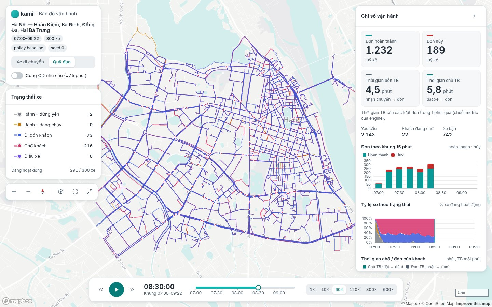 | 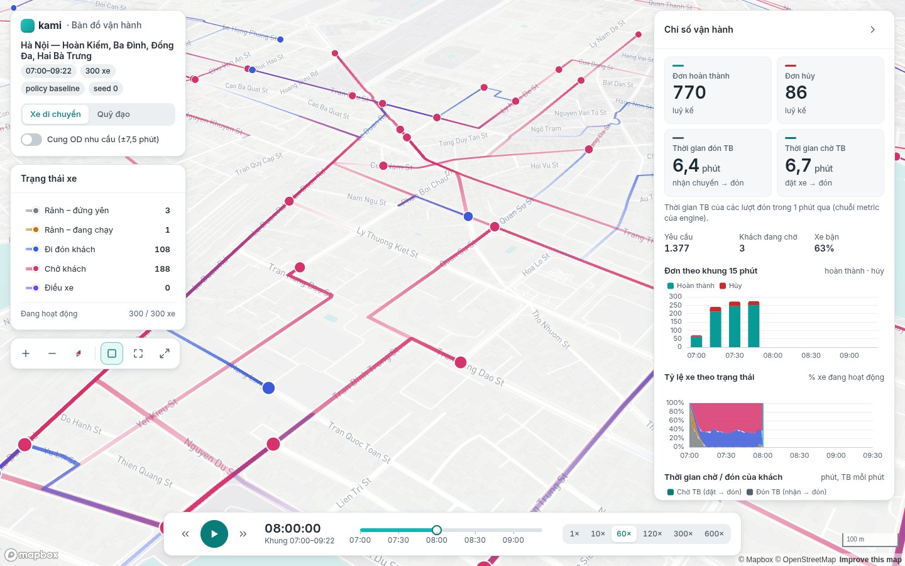 |
| **Chi tiết xe** | **Ẩn trạng thái "Chở khách" và "Rảnh – đứng yên"** |
| 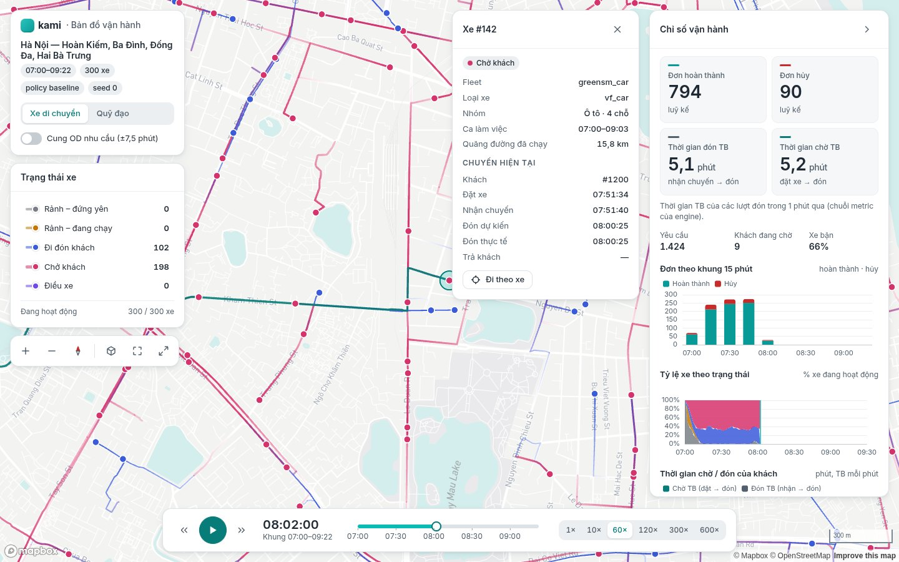 | 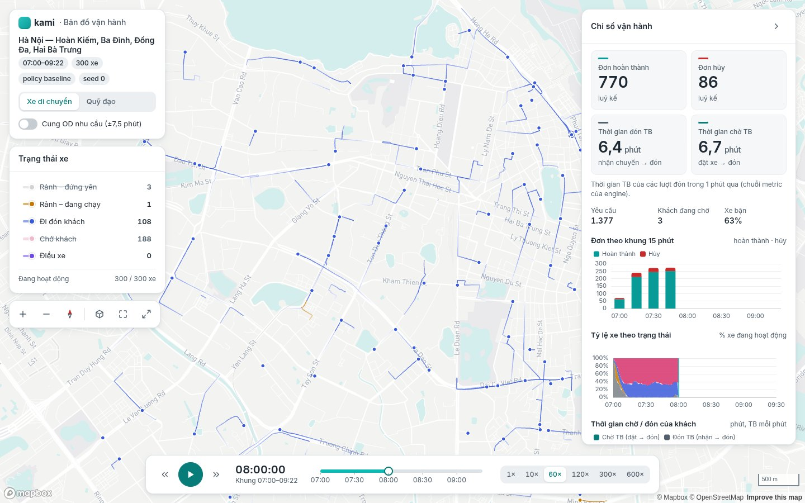 |
| **Ẩn bảng metric** | **Cung OD (±7,5 phút)** |
| 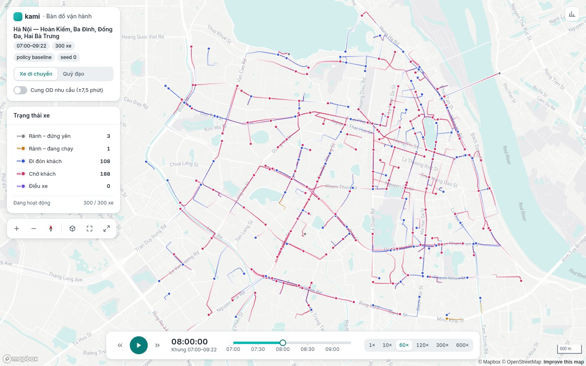 | 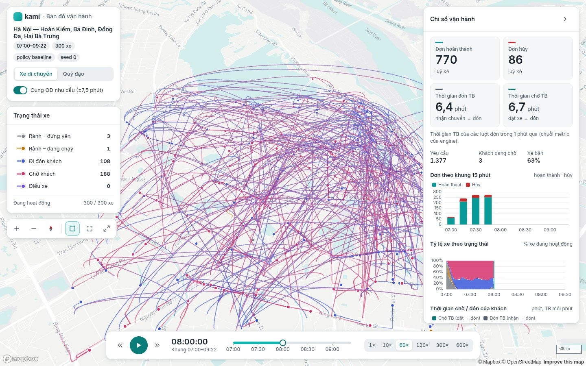 |

Màn hình 1280 × 800: [overview-1280.jpg](img/visualizer/overview-1280.jpg). Trang thành phần (`/ui`):
[components.jpg](img/visualizer/components.jpg).

### Cách hiển thị

- **Một nguồn thời gian:** đồng hồ mô phỏng nằm trong store (`src/store/playback.ts`); khi phát, mỗi khung hình cộng
  `Δt thực × tốc độ`. Bản đồ dựng lại layer **ngoài React** (đăng ký store, gom về một `requestAnimationFrame`); panel
  đọc đồng hồ đã điều tiết (100–250 ms).
- **Vị trí xe tại `t`** (D13, `src/data/replay.ts`): segment của xe có `t0 ≤ t < t1` (tìm nhị phân), nội suy tuyến
  tính giữa hai điểm quanh `t`. Quy tắc giống hệt `kami.replay.query` — Vitest so với 200 mẫu do Python xuất
  (`tests/data/replay/make_web_samples.py` → `web/src/data/__fixtures__/grid_small/`; test Python kiểm fixture này
  luôn cập nhật).
- **Vệt** (`src/map/layers.ts`): mỗi trạng thái một `TripsLayer` (dữ liệu nhị phân dựng một lần; mỗi khung chỉ đổi
  `currentTime`). Chế độ "xe di chuyển": vệt 180 s mô phỏng mờ dần; chế độ "quỹ đạo": mọi đoạn đã chạy tới `t`, không
  mờ, độ đậm 0,4 (đường nhiều xe đi đậm lên). Độ rộng theo mét (6 m, chở khách 9 m) kẹp 1,5–7 px nên tự co giãn theo
  zoom.
- **deck.gl vẽ trên canvas riêng** phía trên bản đồ (`MapboxOverlay` không interleaved): mỗi khung hình chỉ vẽ lại
  các lớp xe, Mapbox không phải vẽ lại tile. Ở chế độ interleaved (vệt nằm dưới tên phố, `?interleaved=1`) mỗi khung
  của deck.gl buộc Mapbox vẽ lại toàn bộ bản đồ — trên GPU tích hợp, zoom 16 nghiêng 60° chỉ còn 49 fps trung vị (ẩn
  hết lớp xe vẫn 50 fps), so với 270 fps khi tách canvas. Đổi lại vệt nằm trên tên phố (vệt mảnh, bán trong suốt nên
  tên phố vẫn đọc được).
- **Xe:** `ScatterplotLayer` (chấm luôn tròn khi nghiêng, viền trắng để nổi trên nền sáng, bán kính 16 m kẹp
  3,5–9 px), màu theo trạng thái; ẩn trạng thái → ẩn cả xe. Kế hoạch layer (`src/map/layerPlan.ts`) là hàm thuần có
  test (AC03-4).
- **KPI và biểu đồ** đọc `metrics.json`: dòng cuối có `t_row ≤ t` (đúng định nghĩa snapshot của S01-6) và chỉ vẽ dữ
  liệu tới `t`. Tỷ lệ xe theo trạng thái tính từ dòng thời gian của replay tại các mốc metric — khớp màu trên bản đồ.
- **Tải dữ liệu:** `ReplaySource` (`src/data/loader.ts`) — Sprint 03 có `StaticReplaySource` (file tĩnh); file
  `.gz` giải nén bằng `DecompressionStream` (nếu server đã giải nén theo `Content-Encoding` thì đọc thẳng).

## 4. Design tokens & thành phần (`web/src/design`, `web/src/ui`)

Một nguồn: `src/design/tokens.json` → `scripts/build-tokens.mjs` sinh `tokens.css` (CSS custom properties) và
`tokens.ts` (deck.gl/ECharts cần giá trị) — chạy tự động trước `dev`/`build`. Light mode là chế độ nghiệm thu; dark
mode chưa làm (chỉ cần thêm bộ biến).

| Nhóm | Giá trị |
|---|---|
| Thang Tiffany | 50 `#E6F7F6` · 100 `#C2EDEB` · 200 `#94E0DD` · 300 `#5ECFCB` · 400 `#2EC3BF` · **500 `#0ABAB5`** (nhấn, đường biểu đồ, viền chọn) · 600 `#089A96` (focus, cột hoàn thành) · **700 `#077C79`** (nút chính chữ trắng, liên kết) · 800 `#065F5D` · 900 `#044341` |
| Nền / chữ | nền trang `#F5F7F8`, panel `#FFFFFF`, viền `#DDE2E6`; chữ `#1F2933`, chữ phụ `#52606D`, chữ mờ `#7B8794`; nguy hiểm `#C92A2A`; nền bản đồ `#F3F4F2`, nước `#D4EEED` |
| Chữ | Inter (tự host qua `next/font`, có tiếng Việt, số tabular), cỡ 12/13/14/16/20/28 px, đậm 400/500/600/700 |
| Khoảng cách, bo góc, bóng, chuyển động | Lưới 4 px (4…40); bo 6/10/14 px; 2 mức bóng nhẹ; 150/250 ms |

**Tương phản (WCAG 2.x, `src/design/tokens.test.ts` — AC03-7):**

| Cặp | Tỷ lệ |
|---|---|
| Chữ `#1F2933` / panel trắng | 14,8 : 1 |
| Chữ phụ `#52606D` / trắng · / nền `#F5F7F8` | 6,5 : 1 · 6,0 : 1 |
| Chữ trắng / nút chính `#077C79` | 5,0 : 1 |
| Liên kết `#077C79` / trắng | 5,0 : 1 |
| `#0ABAB5` / trắng (chỉ dùng trang trí, không cho chữ) | 2,4 : 1 |

Mọi cặp chữ/nền khai báo trong `tokens.json → contrast.text` ≥ 4,5 : 1 (chữ mờ cỡ lớn ≥ 3 : 1); đồ hoạ (focus, cột
biểu đồ, nút chính) ≥ 3 : 1.

**Màu trạng thái xe — hai phương án** (D12; không dùng xanh lục/xanh ngọc để khỏi lẫn với Tiffany; mọi màu ≥ 3 : 1
với nền bản đồ và nền panel, khác nhau đôi một ΔE ≥ 20 và khác Tiffany ΔE ≥ 20 — có test):

| Trạng thái | A | B (theo bảng màu thân thiện mù màu của Paul Tol, làm đậm) |
|---|---|---|
| Rảnh – đứng yên | `#7A7F87` | `#7A7F87` |
| Rảnh – đang chạy | `#C77700` | `#C77700` |
| Đi đón khách | `#3B5BDB` | `#0077BB` |
| Chở khách | `#D6336C` | `#CC3311` |
| Điều xe | `#7048E8` | `#AA3377` |

| A, zoom 12 | B, zoom 12 |
|---|---|
| 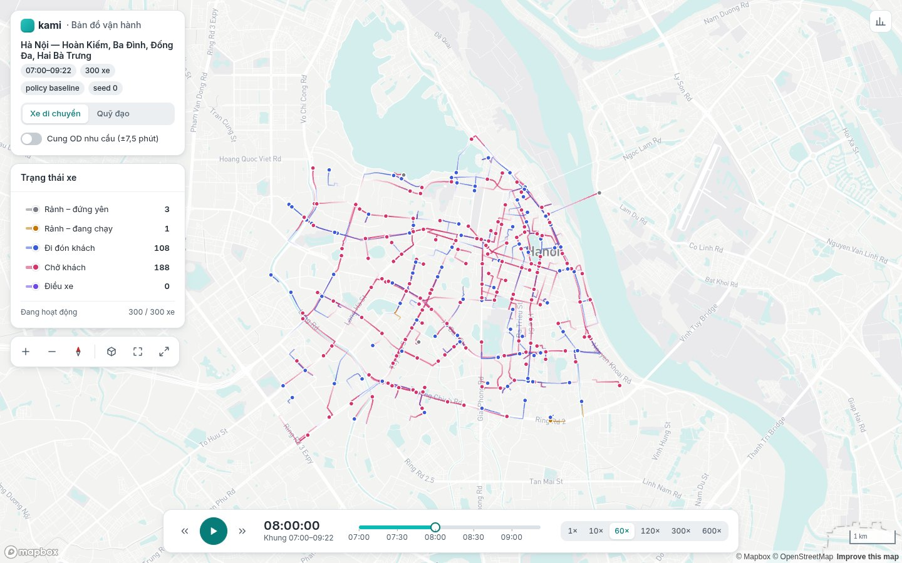 | 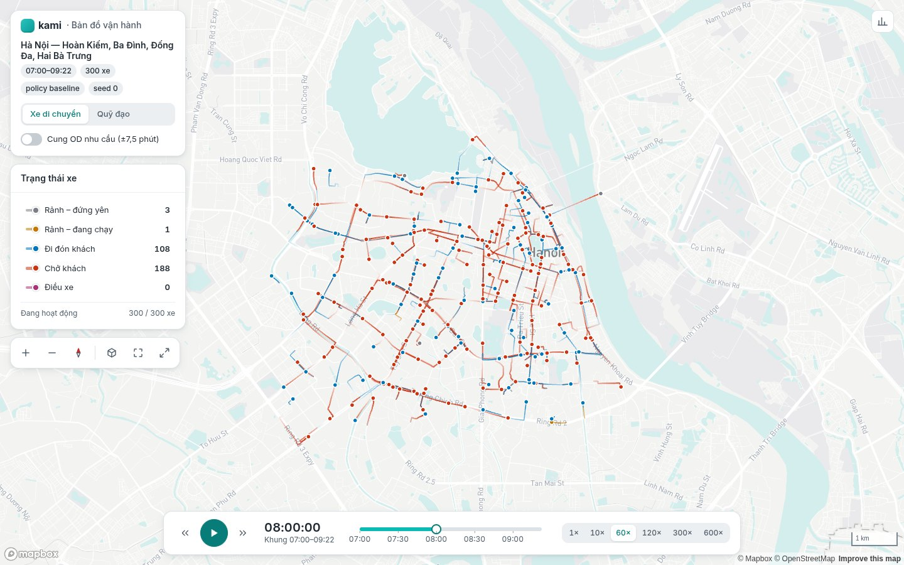 |
| **A, zoom 15** | **B, zoom 15** |
| 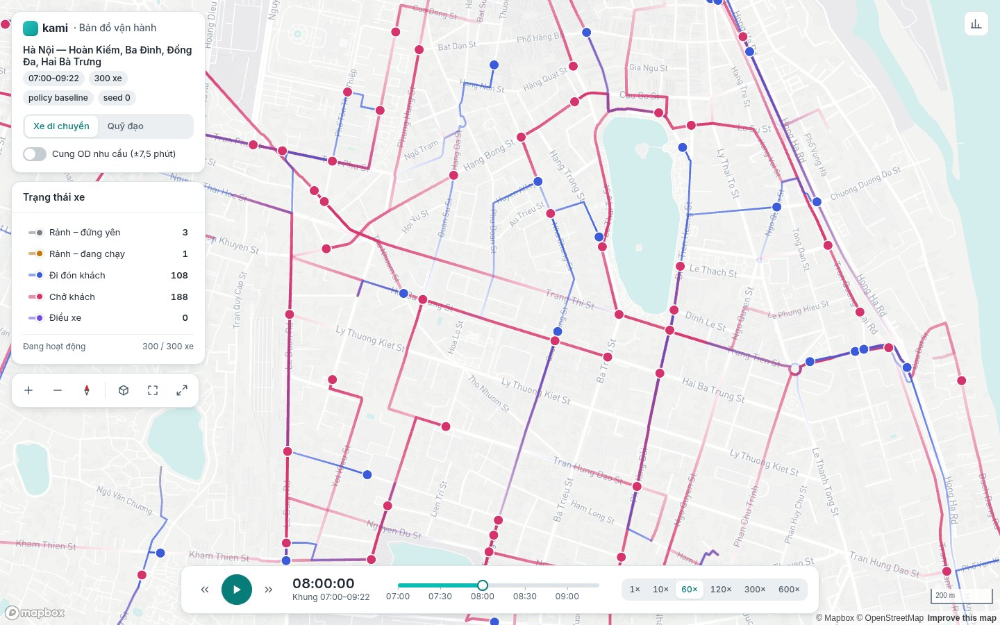 | 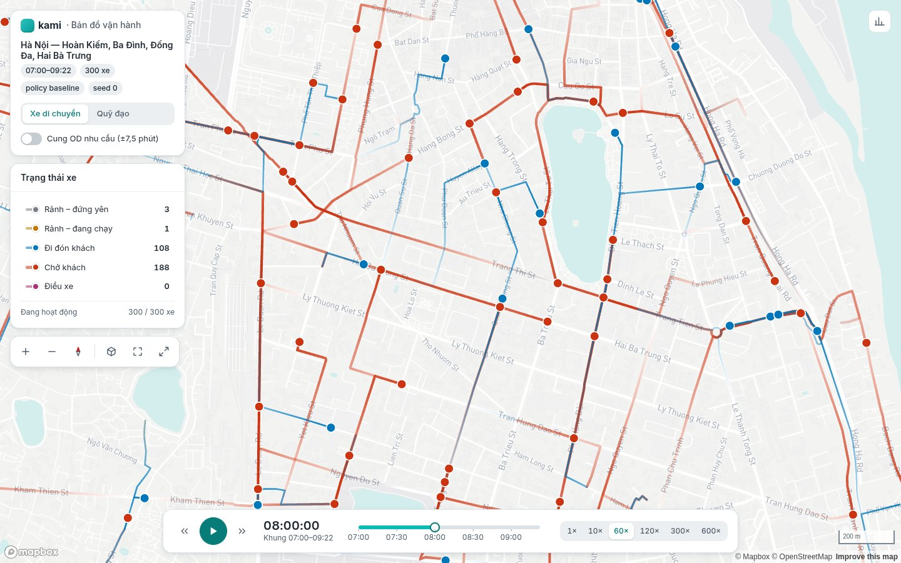 |

Không dựa chỉ vào màu: chú giải luôn có nhãn chữ và số xe, vệt "chở khách" dày hơn.

**Thành phần** (`src/ui/index.tsx`, CSS Modules, dùng lại ở Sprint 09): `Panel`, `Button` (primary/secondary/ghost,
2 cỡ), `IconButton` (kèm tooltip), `Tooltip`, `Toggle` (switch), `Segmented` (radio group, phím mũi tên), `KpiCard`,
`Timeline` (slider có mốc, phím mũi tên/Home/End), `LegendChip` (công tắc trạng thái), `Badge`; bộ icon SVG
(`src/ui/icons.tsx`). Trang `/ui` hiển thị toàn bộ.

## 5. Hiệu năng (AC03-6, quyết định D16)

`?debug=1` hiện bộ đếm khung hình (trung vị, phân vị 5% của fps trên cửa sổ trượt; nút "Đo 60 s"; kết quả ở
`window.__kamiFps`). Đo tự động: `npm run dev` rồi `node scripts/fps.mjs http://localhost:3000 60` — Chrome hệ thống
qua `playwright-core`, cửa sổ 1920 × 1080, phát fixture ở 60× trong 60 s tại 3 mức thu phóng, in tên GPU.

Kết quả 2026-10-08 (Ryzen 9 6900HS; Chrome 1920 × 1080 headless — không khoá theo tần số quét nên trung vị có thể
> 60; trên màn hình thật bị chặn ở tần số quét):

| Mức thu phóng | GPU tích hợp Radeon 680M (ANGLE/OpenGL) — trung vị / p5 | GPU rời RTX 3050 (ANGLE/Vulkan, NVK) — trung vị / p5 |
|---|---|---|
| Toàn khu vực, zoom 12 | 285,7 / 108,7 fps | 357,1 / 151,5 fps |
| Quận, zoom 14 | 277,8 / 107,5 fps | 370,4 / 156,3 fps |
| Phố, zoom 16 nghiêng 60° | 277,8 / 107,5 fps | 357,1 / 149,3 fps |

Ngưỡng D16 (trung vị ≥ 55, p5 ≥ 30 fps): **đạt** ở mọi mức. Trước khi tách canvas deck.gl (interleaved), zoom 16
nghiêng 60° trên GPU tích hợp chỉ 48,8 / 29,0 fps (không đạt).

Ảnh tài liệu: `node scripts/screenshots.mjs http://localhost:3000` (ghi vào `docs/engine/img/visualizer/`, PNG; tài liệu dùng bản JPEG nén).

## 6. Giới hạn hiện tại

- Chỉ phát lại từ file; chưa có chế độ live, lọc theo fleet/loại xe (Sprint 08/09).
- Định dạng JSON đủ cho vài trăm xe; 8.000 xe toàn thành phố (Sprint 04) có thể cần định dạng nhị phân và tải theo
  khung thời gian.
- Có lớp người đặt đang chờ theo Shared/Exclusive; chưa có trạm sạc, surge (Sprint 05/06/09), dark mode.
- KPI thời gian đón/chờ là trung bình trong cửa sổ metric (60 s ở fixture) nên dao động; phút không có lượt đón hiện
  "—".

## 7. Ghép vào ứng dụng quản lý (Sprint 09 A)

Visualizer demo mở ở / và /visualizer, dùng chung điều hướng/chỉ báo run của [Simulation manager](22-ui-guide.md).
Các query fixture của Sprint 03 giữ nguyên. Frontend từ Sprint 09 chạy bằng Next server (npm run build → npm start),
không dùng serve out. Bản đồ fixture có nhãn demo; /visualizer?run=<id> xem trạng thái/metric đúng run, chưa có xe
live hoặc replay qua API. Bộ đọc replay/renderer của Sprint 03 giữ nguyên để tích hợp tiếp Sprint 04.

## Replay Shared V1

Manifest v1 thêm block shared tùy chọn: pairs, riders, bốn stops, prediction và
khoảng overlap actual. Loader vẫn đọc fixture legacy thiếu block. Bộ chọn cặp
và bảng xe cho thấy hai khách, từng stop, số onboard tại t và trạng thái đi chung.
Mở `/visualizer?replay=/fixtures/shared_v1_demo`; đây là replay engine thật với
demand minh họa, không phải run live trong DB. Export từ thư mục CLI giữ metadata
qua shared.json. Ảnh 1280/1440 và hướng dẫn tại [Shared V1](23-shared-rides-v1.md).

### Lọc xe ghép và người đặt (2026-10-10)

Trong **Trạng thái xe**, bật/tắt **Xe share** như các dòng Rảnh, Đi đón khách, Chở khách.
Xe thuộc mục này trong khoảng `[created_t, closed_t)` của cặp, kể cả chặng đi đón và
sau khi trả khách đầu tiên. Xe chỉ tính ở một dòng chú giải tại mỗi thời điểm; KPI/biểu đồ
giữ các trạng thái vận hành của engine. Muốn chỉ theo dõi cặp ghép, tắt các dòng xe khác.
Màu xanh đậm và vệt đường ghép được lọc độc lập trong cả Xe di chuyển và Quỹ đạo; đường
được cắt tại mốc tạo/kết thúc cặp. Xe được chọn nhưng đang bị ẩn không vẽ halo/đường chọn.
Replay thiếu metadata Shared hiển thị Xe share = 0 và liên kết sang demo.

Phần **Người đặt đang chờ** có hai công tắc độc lập: **Đặt Shared (S)** và **Đặt Exclusive (E)**,
mặc định tắt. Marker vòng tròn có chữ S/E tại điểm đón, xuất hiện từ lúc BOOKED, biến mất
đúng lúc pickup/cancel. Người từ chối đặt không có marker; khách đã onboard không đứng
lại ở điểm đón. Rê chuột xem mã khách và lựa chọn. Số bên cạnh công tắc là số đang chờ,
kể cả khi lớp đang ẩn; tua ngược tính lại theo đồng hồ replay. Replay cũ chưa có service
preference dùng nhóm Exclusive cho lượt BOOKED. Cung OD nhu cầu vẫn là lớp riêng.

Cột điều khiển bên trái cuộn khi không đủ chiều cao để các công tắc/bộ chọn cặp không
tràn khỏi màn hình. Kiểm chứng bằng `npm test`, `npm run typecheck`,
`npm run test:shared-v1-e2e`; E2E kiểm cả data/glyph của lớp deck.gl đang vẽ và bàn phím.

### Xem toàn bộ quy trình Shared

Mặc định `/visualizer` mở `shared_v1_walkthrough`, một xe và hai khách trên mạng Hà Nội.
Bảng cặp đặt trước chú giải: nhấn **Xem từ đầu · 10×** để bắt đầu trước booking đầu tiên,
tự bật lớp khách Shared và chọn xe. Bộ chọn cặp cũng tua về trước booking, không nhảy
thẳng tới lúc ghép. **Các mốc đặt, ghép, đón và trả** cho tua từng bước; dòng trạng thái
nêu chờ ghép, đi đón từng người, hai người onboard, trả từng người và hoàn tất. Các điểm
đón/trả cố định được ghi `Đón #id`, `Trả #id`; hậu tố `xong` chỉ xuất hiện sau mốc thực tế.

Hai khách đặt 07:00:10/07:00:30; batch ghép 07:01:00. Xe đi từ vị trí khác tới đón #2
07:02:25, đón #1 07:03:48, trả #2 07:07:34 rồi trả #1 07:09:30. Bốn điểm khác nhau,
mọi đường xe chạy/mốc thời gian từ engine; không dựng chuyển động hay ETA bằng UI.
Giả định minh họa khách chắc chắn đặt và không hủy để quy trình hoàn tất dễ quan sát.
Sinh lại bằng `python examples/10_shared_ride_walkthrough.py`. Các fixture cũ và hợp đồng
replay v1 vẫn giữ; số benchmark Sprint 03 ở trên thuộc demo 300 xe cũ.
