# 22 · Giao diện quản lý mô phỏng (Sprint 09, giai đoạn A)

Plan: [sprint-09-plan.md](../implementation-plan/sprint-09-plan.md).
Giao diện dùng API [backend Sprint 08](21-service-api.md); cấu hình và kết quả được lưu trong SQLite.
Giai đoạn A cung cấp loại xe, fleet, kịch bản, chạy/huỷ và metric. UI trạm sạc tạm hoãn theo yêu cầu người dùng.
Bản đồ live và phát lại run qua API vẫn chờ phụ thuộc; bản đồ demo là fixture riêng, luôn có nhãn.

## 1. Khởi động

Môi trường Python cục bộ ở `.venv/`; các bước cài lần đầu xem
[README — chạy ứng dụng hằng ngày](../../README.md#chạy-ứng-dụng-hằng-ngày-windows--vs-code).
Mở thư mục gốc trong VS Code và tạo terminal mới để dùng interpreter/PATH từ
`.vscode/settings.json`. Terminal ngoài VS Code cần kích hoạt `.venv` trước.

Từ thư mục gốc repo:

    python -m kami.service

Trong terminal khác:

    cd web
    npm ci
    npm run dev

Mở http://localhost:3000/scenarios. Các trang:
Kịch bản (/scenarios), Đội xe & loại xe (/fleets), Kết quả & so sánh (/metrics), Bản đồ mô phỏng (/visualizer).
Địa chỉ / vẫn mở visualizer demo và nhận các query replay/t/view/palette như trước.

Frontend gọi /api/v1 qua Next.js tới backend. Nếu backend ở origin khác, đặt KAMI_SERVICE_URL trong
web/.env.local trước khi chạy dev/build, ví dụ http://127.0.0.1:8000.
Chỉ cấu hình origin HTTP(S), không thêm đường dẫn /api/v1. Biến này dùng ở server, không phải token trình duyệt.

Production:

    cd web
    npm run build
    npm start

Từ Sprint 09 frontend cần Next.js server để proxy API/SSE; không còn triển khai bằng serve out.
Rewrites được tạo khi build, nên đổi origin backend cần build lại. .env.local/token Mapbox không commit.

- kami.db (hoặc đường dẫn --db) lưu entity, mẫu kịch bản, snapshot run, trạng thái và metric.
- runs/<run_id>/ (hoặc --artifacts) lưu file output được bật; SQLite lưu metadata/đường dẫn.
- Đường dẫn tương đối tính từ thư mục chạy service. Tắt service hoặc reload web không xoá dữ liệu.
- Không dùng dữ liệu browser storage thay database. Khi mất kết nối, kiểm tra service và origin; nút chạy
  được khoá tới khi xác nhận lại trạng thái. Lần chạy đang diễn ra không bị huỷ vì đóng trang web.

## 2. Tạo loại xe và fleet

Ở Đội xe & loại xe:

1. Tab Loại xe → Thêm loại xe: tên, nhóm ô tô/xe máy, số chỗ, quãng đường tối đa (km, có thể để trống).
2. Lưu; cấu hình xuất hiện trong danh sách và còn sau reload.
3. Tab Fleet → Thêm fleet: tên, thêm từng thành phần (loại xe × số lượng).
4. Sửa hoặc xoá từ từng dòng. Xoá có xác nhận; loại xe đang được fleet dùng không xoá/đổi tên được.

Quãng đường tối đa hiện chỉ là cấu hình; giai đoạn A chưa mô phỏng SOC/sạc. Không có tab quản lý trạm sạc.
Thông số sản phẩm, ca và phân bố ban đầu sẽ bổ sung khi engine/backend hỗ trợ.

Nhập tên vào ô tìm kiếm để lọc loại xe hoặc đội xe trong tab đang mở. Tổng xe cấu hình là tổng
thành phần của các fleet đã lưu, không phải số xe đang hoạt động hay số xe của một lần chạy.

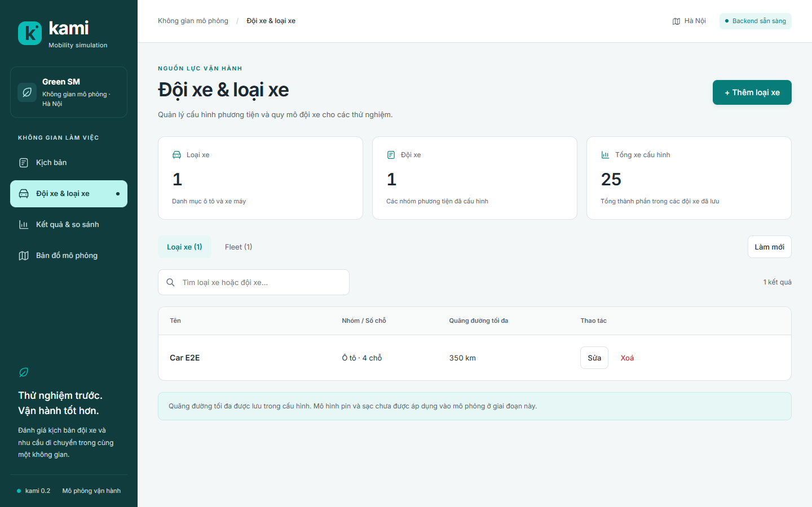

## 3. Tạo và chạy kịch bản

Ở Kịch bản → Tạo kịch bản:

- Tên kịch bản là tên mẫu cấu hình; nhãn lần chạy dùng để nhận diện run.
- Seed để trống dùng seed trong scenario; CRN seed để trống dùng seed hiệu lực của run.
- Chọn mạng lưới synthetic hoặc mạng đường thật. Mạng thật cần dữ liệu sẵn trên máy service; nhập tên mạng,
  thư mục dữ liệu nếu khác mặc định và bộ zone tương ứng.
- Chọn demand synthetic, preset hoặc zonal; giờ theo đồng hồ mô phỏng HH:MM hoặc HH:MM:SS (24:00:00 là cuối ngày),
  demand cơ sở theo request/giờ. Profile nhu cầu có thể làm số request thực tế khác tích cơ sở × số giờ.
- Chọn một hoặc nhiều fleet. Số xe lấy từ thành phần fleet đã lưu.
- Nhóm Thời tiết & sự cố cho lịch thời tiết, thời điểm sau giờ bắt đầu, thời lượng/bán kính/hệ số chậm và vị trí sự cố.
- Chọn nhịp metric theo giây mô phỏng hoặc tắt thu chuỗi thời gian. Thời gian hoàn tất chuyến sau demand
  mặc định engine 3.600 giây nếu không cấu hình.

Lưu kịch bản rồi bấm Chạy. Ứng dụng tạo snapshot queued, sau đó yêu cầu start. Chỉ có một run chạy mỗi lần.
Nếu backend báo bận sau khi đã tạo snapshot, giữ run queued để bắt đầu lại từ cùng snapshot; không tạo trùng.
Run terminal không chạy lại: bấm Chạy kịch bản sẽ tạo một run mới.
Có thể huỷ queued/running trong lịch sử hoặc trang thông tin run.

Mọi trang hiện chỉ báo tên kịch bản/tiến độ của run active. Tiến độ/ETA có thể chưa xác định lúc nạp dữ liệu.
Sửa kịch bản/fleet sau khi tạo run không đổi snapshot của run đã có.

Lỗi kiểm tra hoặc tên trùng được hiện trong form; nội dung đã nhập vẫn giữ để sửa và gửi lại.
Danh sách hiển thị cấu hình mạng đường, nguồn nhu cầu và số đội xe. Nhập tên ở ô tìm kiếm để lọc kịch bản.
Trong form, các liên kết Thông tin chung / Bản đồ / Nhu cầu / Đội xe / Kết quả đưa tới từng nhóm cấu hình;
form mở trong modal có vùng cuộn riêng, nút lưu được giữ ở đáy vùng nhìn. Trang danh sách phía sau giữ vị trí khi mở/đóng modal. Backend chưa cung cấp thời điểm cập nhật.
Nguồn CSV/fleetpy và fleet inline có sẵn trong mẫu được giữ nguyên khi chỉnh các trường khác; editor chi tiết
nguồn đặc biệt chưa có. Đổi nguồn/network/zone có xác nhận vì thay nhóm tham số.
Trường charging_stations trong mẫu cũ được giữ nguyên khi sửa, kịch bản mới không chọn/thêm trạm.

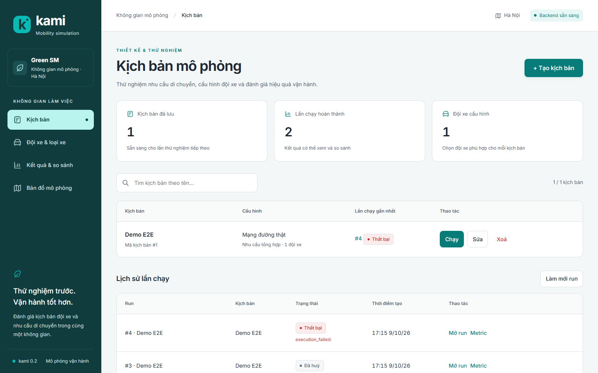

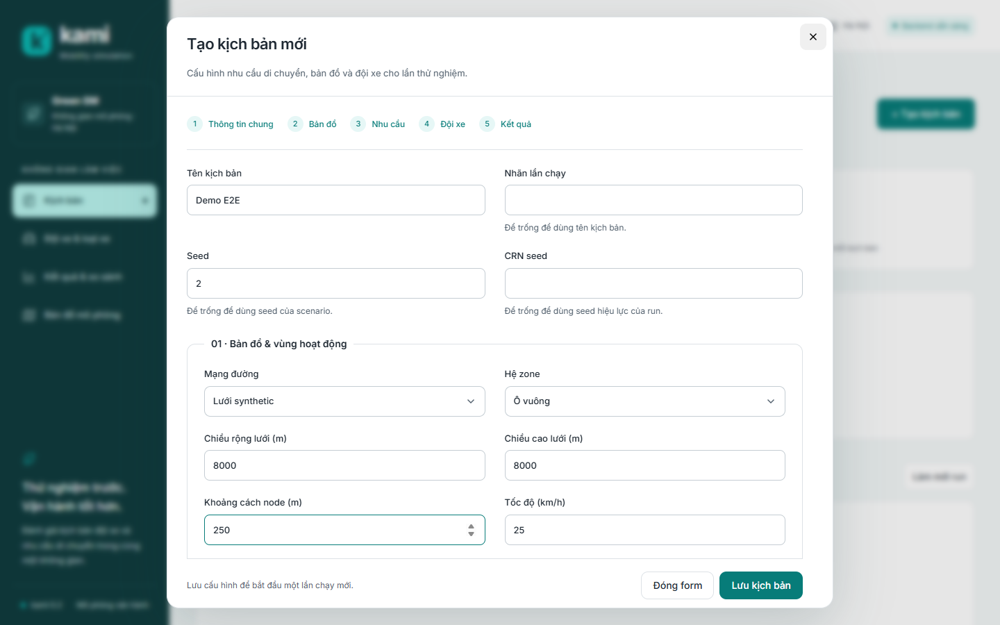

## 4. Theo dõi metric và so sánh

Ở Metric, chọn một run:

- Run succeeded: metric tổng hợp và chuỗi thời gian đọc từ database; nút CSV tổng hợp/chuỗi thời gian xuất số gốc.
- Run running: metric live qua SSE, tối đa 2.000 hàng gần nhất. Nếu mất lịch sử/reconnect có khoảng thiếu thì
  giao diện báo rõ; khi succeeded tải lại kết quả đầy đủ từ DB.
- Run failed/cancelled/queued: không quảng bá kết quả một phần như kết quả hoàn chỉnh; failed có lỗi để kiểm tra.

Thời gian metric là phút, quãng đường km, tiền VND; mốc trục thời gian là giây từ đầu ngày.
Tỷ lệ dùng giá trị gốc [0,1], không tự đổi sang phần trăm. Không xác định hiển thị — và CSV để trống.
Metric pooling/policy không đưa vào UI mới.

Tab So sánh các run: chọn một baseline và một hoặc nhiều candidate đã succeeded (tổng 2–20 run), bấm So sánh.
Bảng lấy delta, phần trăm và verdict từ API. Delta = candidate − baseline; phần trăm không xác định khi baseline
bằng 0. Màu luôn đi kèm chữ Tốt hơn/Kém hơn/Bằng nhau; metric chẩn đoán không có verdict tốt/xấu.
Cảnh báo kịch bản/seed/fleet/môi trường khác được giữ theo từng candidate. Đây không phải kiểm định nhiều seed.
Xuất CSV so sánh giữ cả warning, direction và verdict.

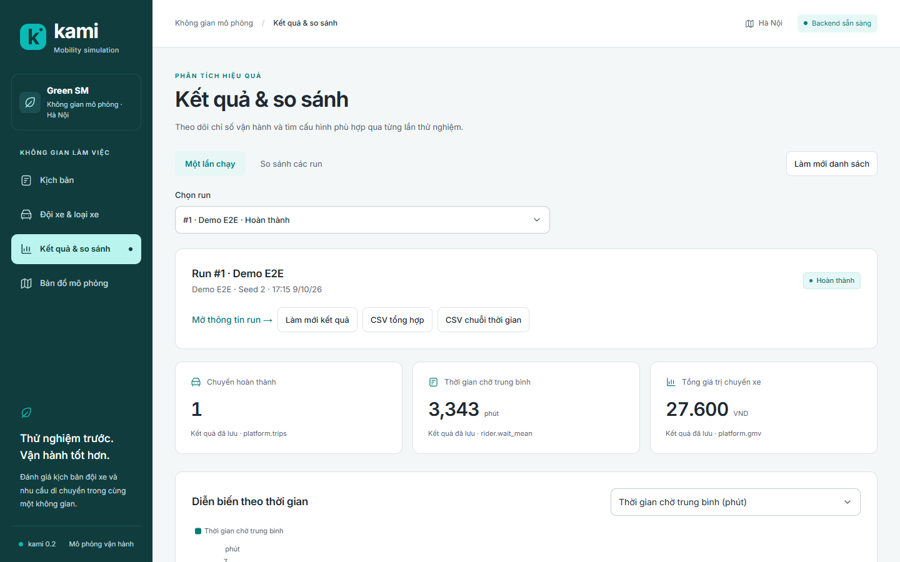

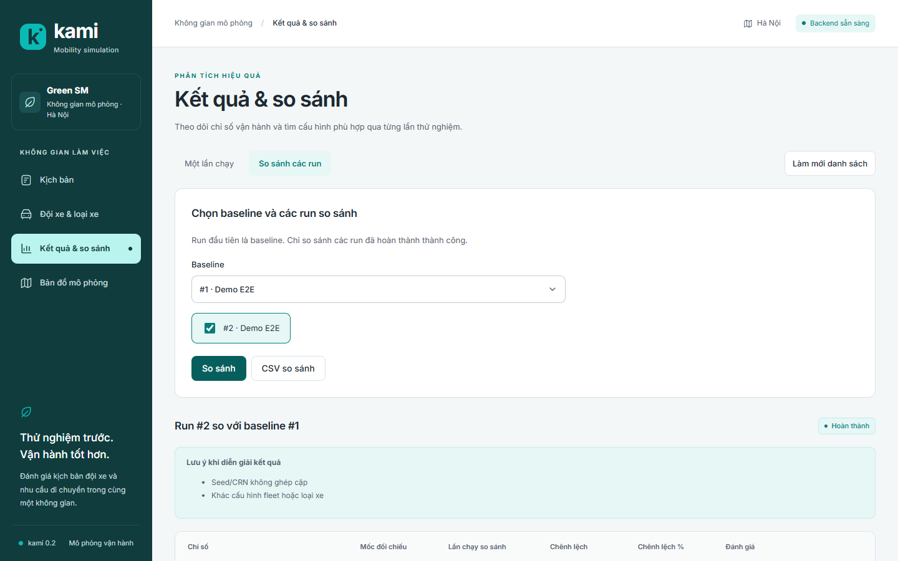

## 5. Visualizer và giới hạn giai đoạn A

Visualizer không có query run mở bản đồ fixture, vẫn dùng bộ đọc và renderer của Sprint 03.
Các điều khiển Mapbox, tua/phát lại, trạng thái/vệt xe, KPI demo giữ nguyên; xem [20-visualizer.md](20-visualizer.md).
Mapbox cần public token theo hướng dẫn Sprint 03. Manager và metric không cần token này.

Mở /visualizer?run=<id> từ banner hoặc lịch sử để xem đúng trạng thái/metric của run trong DB.
Trang này không vẽ xe fixture dưới tên run thật. Xe/vệt live, phát lại qua API, bộ lọc fleet/type/product,
khách chờ và PERF-4 chờ hợp đồng snapshot/replay cùng engine/backend ở giai đoạn B.
Matching/pricing nâng cao, phân rã metric và EV đầy đủ cũng chờ phụ thuộc.

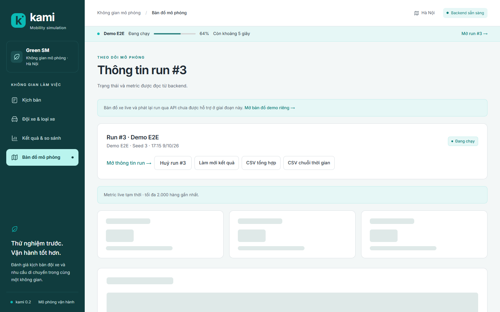

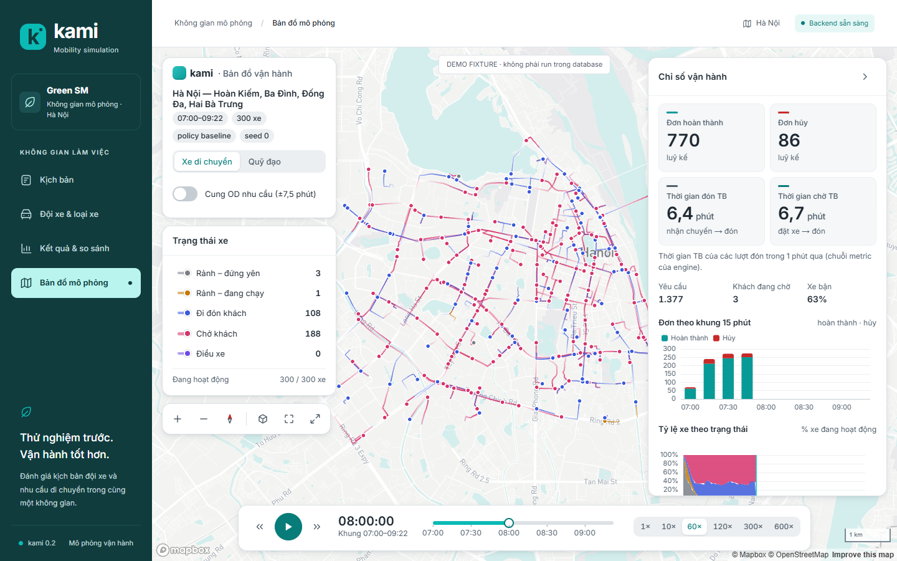

## 6. Kiểm thử và vận hành

    cd web
    npm test
    npm run typecheck
    npm run build
    npm run test:manager-e2e

E2E dùng Chrome hệ thống (CHROME), Python có service extra (PYTHON), SQLite/artifacts riêng trong thư mục tạm.
Port mặc định: backend 8099, Next 3139; có thể đổi KAMI_E2E_API_PORT/KAMI_E2E_WEB_PORT.
Test từ chối nếu port đang bị dùng; không dùng DB người dùng.
KAMI_TEST_PYTHONPATH là đường dẫn dependency riêng nếu môi trường test cần; không cần đặt trong môi trường đã cài đủ.
KAMI_E2E_DEV=1 kiểm Next dev; mặc định build và chạy production. KAMI_E2E_SKIP_BUILD=1 chỉ dùng khi build hiện tại
đã trỏ đúng origin test. Sau kiểm thử production, chạy npm run build lại với origin muốn dùng thực tế.

Script kiểm CRUD/reload, conflict giữ draft, run worker thật, metric/CSV/compare, restart service,
chỉ báo run trên 4 trang, SSE xuyên proxy, khoá bận, huỷ run, xác nhận xoá, tìm kiếm,
skip link bằng bàn phím, tên/kích thước điều hướng và bố cục 375/768/1280/1440 cùng wrapper demo.
Ảnh mới ghi tại docs/engine/img/manager/redesign; log/result mặc định tại .runtime/sprint09/e2e.
Đặt KAMI_E2E_EVIDENCE_DIR để chọn thư mục bằng chứng khác khi thư mục cũ không ghi được.
Host Python dùng file điều khiển shutdown, không dùng stdin pipe để tránh cản worker spawn trên Windows.
Bằng chứng nghiệm thu từng phần và lỗi nền/audit còn mở ghi ở plan; Sprint 09 chưa Xong sau giai đoạn A.

## 7. Thiết kế workspace Green SM

Thiết kế ngày 2026-10-09 áp dụng skill ui-ux-pro-max cho dashboard vận hành: nền sáng, sidebar xanh đậm,
nhấn cyan, thẻ tổng quan và bảng có phân cấp. Giữ Inter, CSS Modules và tokens đã có; bổ sung shadcn/ui và Tailwind v4 theo yêu cầu người dùng. Nghiên cứu và lựa chọn: [green-sm-ui.md](../research/green-sm-ui.md).

Sidebar hiển thị tên trang và vị trí hiện tại. Trên tablet, điều hướng thu gọn thành biểu tượng có tên
truy cập; trên điện thoại, biểu tượng đi kèm nhãn ngắn. Dùng Tab để tới “Đến nội dung” và Enter để
đưa focus vào workspace. Bảng dài cuộn trong vùng riêng, các ô nhập trên điện thoại dùng cỡ 16 px.

Kết quả thành công có thẻ chuyến hoàn thành, thời gian chờ trung bình và tổng giá trị chuyến.
Tên chỉ số phổ biến được diễn giải bằng tiếng Việt; mã gốc vẫn có trong bảng. Giá trị thiếu hiển thị —;
đơn vị, dữ liệu gốc xuất CSV và đánh giá so sánh tiếp tục lấy theo API.

## 8. Loading và component shadcn

Toàn bộ component của registry shadcn radix-nova đã được thêm ở web/src/components/ui (61 file),
cùng hook use-mobile. Tailwind v4 dùng PostCSS và không bật Preflight reset để giữ giao diện
visualizer hiện có. Theme cyan/Green SM ở web/src/app/shadcn.css; CSS Modules tiếp tục dùng cho
bố cục manager. Có thể thêm/cập nhật component bằng npx shadcn@4.21.4 add; CLI không cần là dependency
của ứng dụng sau khi source component đã được sinh. Registry có thể bổ sung component ở phiên bản sau.

LoadingState dùng chung cho route Suspense, danh sách, kết quả và bản đồ; LoadingValue dùng
cho số liệu đang chờ API. Skeleton có nhịp sáng nhẹ, giữ hình dạng nội dung và tắt animation khi
prefers-reduced-motion là reduce. API lỗi không giữ skeleton vô hạn; dữ liệu thiếu/lỗi vẫn hiển thị —.
Danh sách entity và số đếm có loading cả khi người dùng bấm làm mới.

Form loại xe, đội xe và kịch bản mở trong Dialog shadcn; không thay danh sách bằng form.
Modal giới hạn trong viewport, vùng nội dung cuộn riêng, giữ nút lưu và có tiêu đề/mô tả.
Đóng bằng nút Đóng form, dấu × hoặc Escape. Click ra ngoài không bỏ bản nháp. Khi đang lưu, đóng
modal bị khoá; lỗi kiểm tra hiển thị trong modal và giữ dữ liệu đã nhập.
Xác nhận xoá cũng dùng modal chung. Focus được giữ trong modal và trả về nút mở khi đóng bằng Escape.

Dropdown trong manager dùng Select shadcn, menu hiển thị qua portal và hỗ trợ bàn phím;
không còn dropdown native trên màn hình manager. Component Native Select có trong bộ cài
đầy đủ nhưng không dùng cho các màn hình này. Switch dùng shadcn, đường track gọn và nhãn
không có viền/nền; tab chuyển chế độ cũng được bỏ viền bao ngoài.

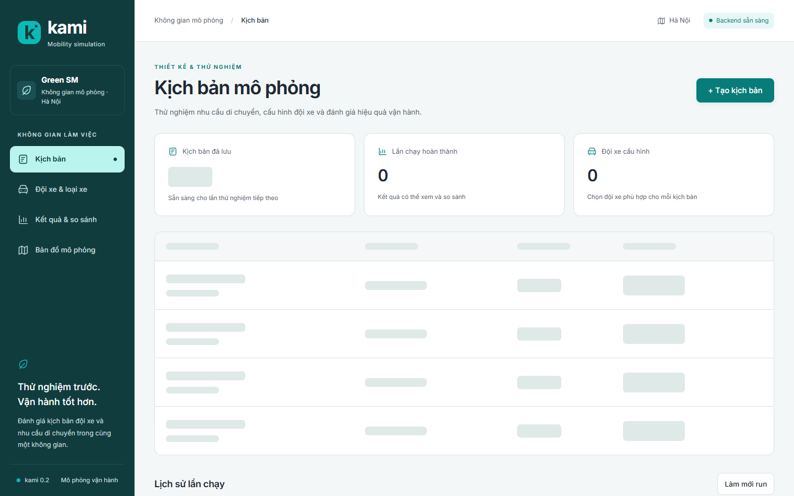

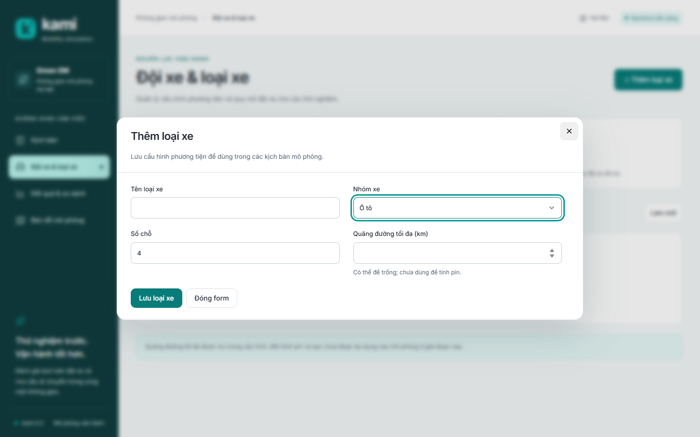

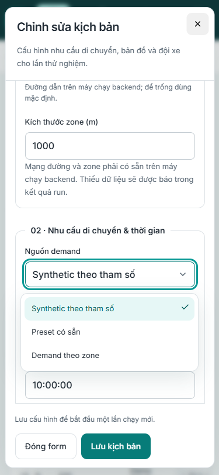

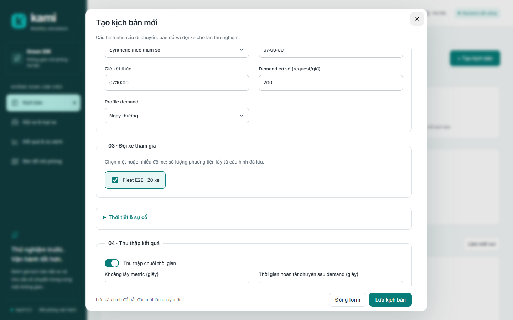

Kiểm thử browser bổ sung: giữ phản hồi API để kiểm loading thực, reduced motion, vị trí trang
khi mở modal, keyboard dropdown, Escape/focus, switch thu metric và modal/menu tại 375/768/1440.
Kết quả lượt cải thiện này ghi tại plan Sprint 09 và file validation riêng.
