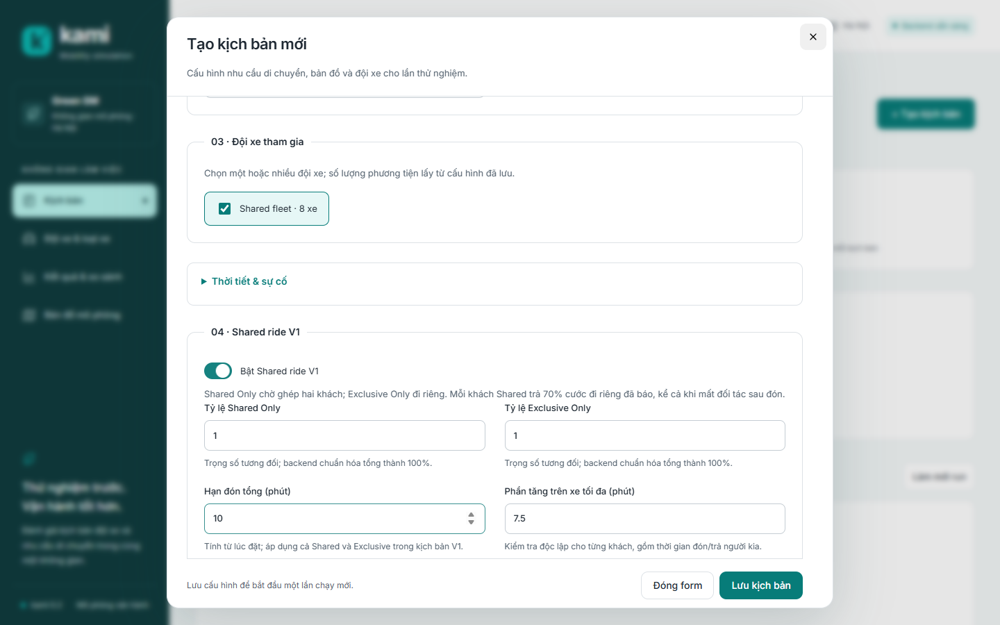
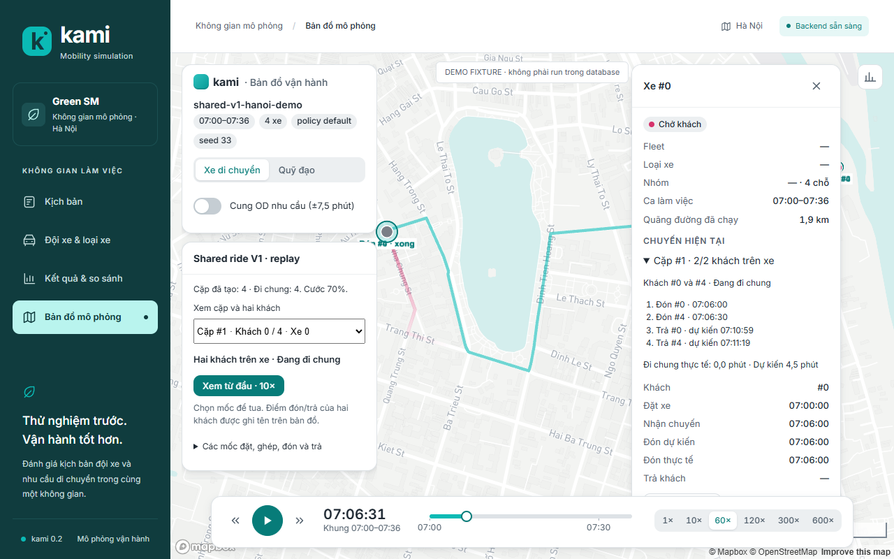
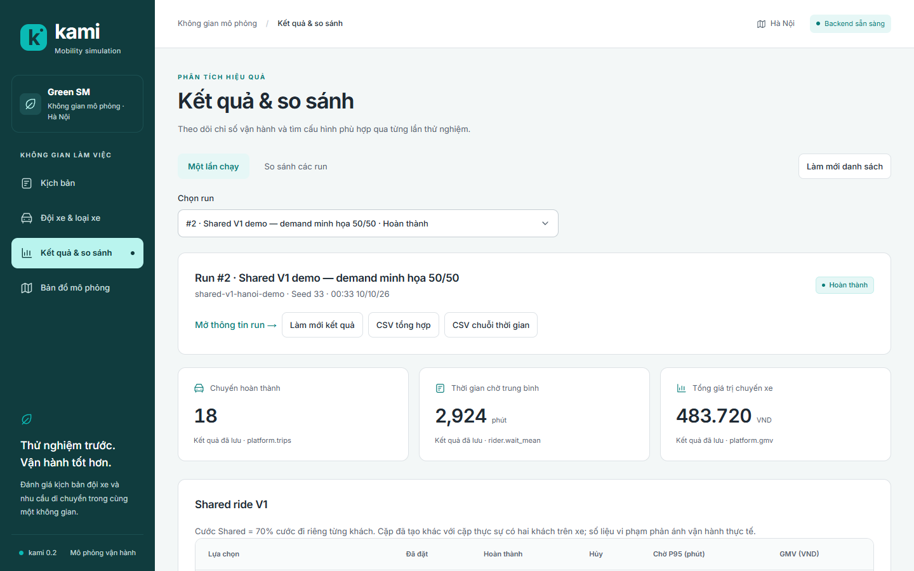
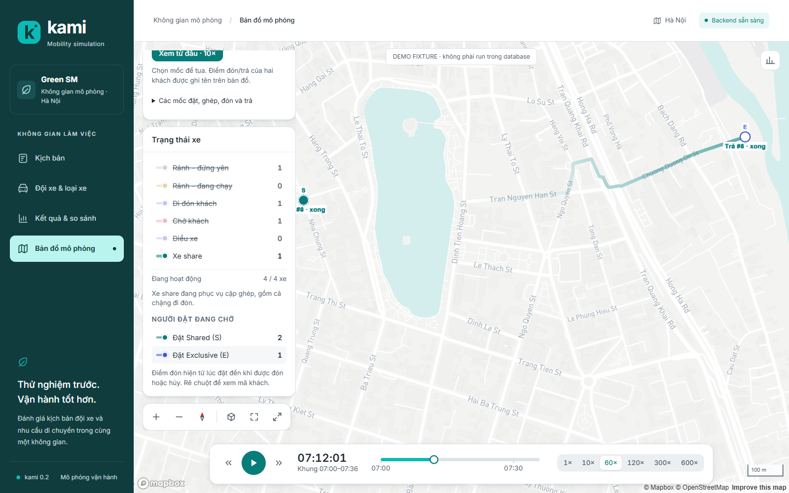
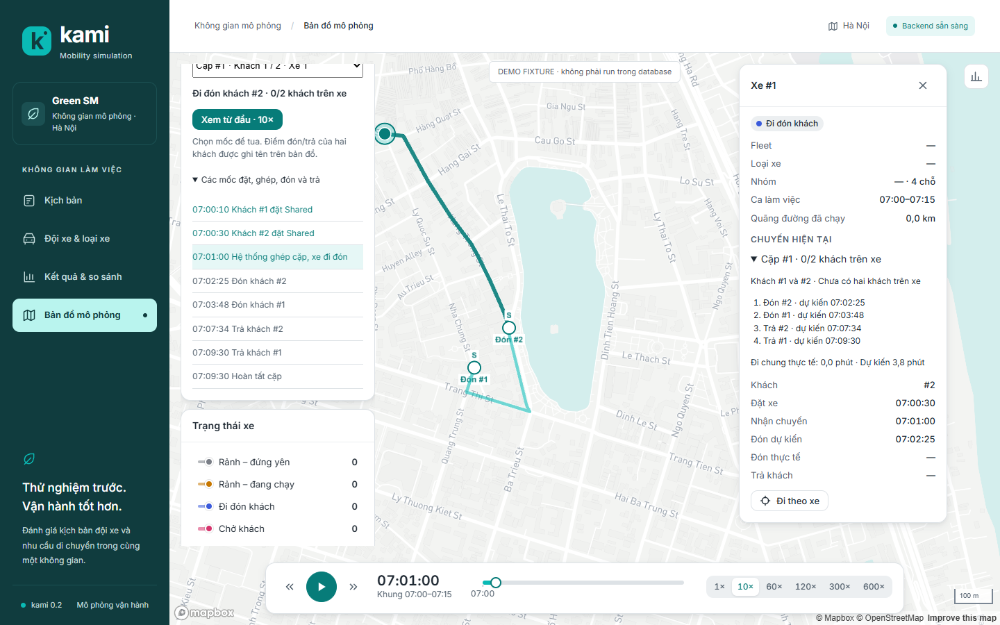

# Shared ride V1

V1 thuộc [Sprint 12](../sprint/sprint-12-shared-rides-v1.md), theo
[plan đã duyệt](../implementation-plan/sprint-12-plan.md). Dùng `kami/shared/` riêng;
pooling và policy của 0.1 giữ để tương thích. Không có Shared Fallback Exclusive.

## Cấu hình và báo giá

Để xem toàn bộ quy trình trên bản đồ, mở `/visualizer` và nhấn **Xem từ đầu · 10×**.
Demo mặc định `shared_v1_walkthrough` có hai khách đặt khác thời điểm, chờ batch ghép,
một xe xuất phát từ xa, hai điểm đón và hai điểm trả khác nhau. Mở **Các mốc đặt, ghép,
đón và trả** để tua từng bước; bản đồ ghi tên điểm đón/trả và bảng báo trạng thái hiện tại.
Demo giả định khách chắc chắn đặt/không hủy, dùng engine thật; không phải dữ liệu GreenSM
đã hiệu chỉnh. Sinh lại bằng `python examples/10_shared_ride_walkthrough.py`.

```python
from kami import SimConfig, SharedRideConfig, Simulation
config = SimConfig(shared_ride=SharedRideConfig(
    enabled=True, preference_weights={"shared_only": 1, "exclusive_only": 1}))
sim = Simulation(scenario, config=config).run()
```

Trong JSON, đặt `sim_config.shared_ride` với cùng các field. Mặc định deadline đón
600 s, extra ride tối đa 450 s, bán kính 500 m. Các giới hạn độc lập; trọng số hữu hạn,
không âm, tổng dương, được chuẩn hóa. Chỉ hỗ trợ `version=1`. Bỏ cấu hình hoặc tắt
`enabled` dùng luồng engine cũ; không thêm namespace metric hoặc metadata replay mới.
Snapshot bật shared chứa đủ defaults, trọng số chuẩn hóa và `fare_factor=0.7` cố định.
Trọng số mặc định là Shared Only = 0, Exclusive Only = 1; ví dụ trên chủ động đặt 1/1.

`RequestSpec.attrs.service_preference` (hoặc cột CSV `service_preference`) ghi rõ
`shared_only` / `exclusive_only`. Thiếu lựa chọn dùng
`CRN(scenario.seed).u("service_preference", request_id)`, sau khi sinh demand.
Không phụ thuộc `crn_seed` riêng cho quyết định run. CSV cũ giữ nguyên lịch/draws;
CSV có thể thêm `latest_pickup`, `latest_dropoff` (giây mô phỏng tuyệt đối).

FareModel tính cước trực tiếp, surge, minimum và làm tròn về 100đ trước discount.
Shared trả đúng 70% cước tham chiếu; không áp minimum/làm tròn lần hai. Ví dụ
25.000đ → 17.500đ. `Quote.fare` và `Rider.fare` chứa cước thực thu ngay trước booking;
`surcharge=0`, không gọi `pool_accept`. Giá giữ khi traffic đổi, tái ghép hoặc mất đối tác.
Chỉ DONE ghi GMV/payout một lần; payout = cước thực thu × (1 − take_rate).

## Đánh giá và dispatch

Hai khách phải WAITING, chưa gán xe; mỗi booking một người. Index bốn chiều theo
tọa độ pickup/destination tìm các ô lân cận rồi kiểm khoảng cách chim bay thực ≤ radius
cho cả hai điểm đầu và hai điểm cuối. V1 bỏ cặp có điểm cuối xa nhau, dù đích của B
nằm trên tuyến A; đây là giới hạn dành cho V2 nghiên cứu tiếp.

Chỉ xét xe available, đủ hai chỗ, chưa hết ca. Cắt xe theo
`MatchingParams.candidates_per_job`, xếp theo khoảng cách tới điểm đón gần nhất rồi
driver ID. Các nhóm xe đi qua router của nhóm thật. Cache chỉ tồn tại trong một tick,
khóa `(origin, destination, departure_time, group)`.

Evaluator thử bốn tuyến từ `current_loc(driver)`:
P_A–P_B–D_A–D_B, P_A–P_B–D_B–D_A, P_B–P_A–D_A–D_B, P_B–P_A–D_B–D_A.
Dùng `traffic.estimate` tại giờ xuất phát từng leg, cộng boarding/alighting.
Pickup phải ≤ booked_t + max_pickup_wait_s và latest_pickup nếu có;
dropoff phải ≤ latest_dropoff nếu có. Không có đường đi thì loại tuyến.

Baseline riêng mỗi khách = boarding của chính họ + thời gian direct tại pickup dự kiến,
cùng nhóm xe. Extra = max(0, dropoff − pickup − baseline), gồm dwell của khách kia,
không gồm alighting của chính khách sau dropoff. Mỗi extra phải ≤ cận cấu hình.
Giao hai khoảng pickup–dropoff phải có thời lượng > 0. Baseline/prediction khóa khi commit.

Greedy shared trước Exclusive. Cost theo thứ tự: deadline sớm của cặp, deadline còn lại,
tổng giây tới hai dropoff từ tick hiện tại, tổng mét xe, hai rider ID chuẩn hóa,
driver ID, thứ tự stops. Trong tick, mỗi cặp–xe chỉ nhận một offer cho tuyến tốt nhất.
Acceptance dùng `shared_driver_accept`, driver ID, rider ID chuẩn hóa và số offer của
chính cặp–xe. Từ chối giữ job/queue; nhận mới commit hai job thành một shared job và gán
plan nguyên tử. Shared job không bật `Job.pooled`; `pair_id` là định danh riêng.

Exclusive được matching theo solver hiện có trên xe còn lại nhưng dùng evaluator
singleton mới để kiểm deadline/cam kết. Không áp cận extra shared cho Exclusive.
Không coi greedy/cắt ứng viên là tối ưu toàn đội.

## Deadline và mất đối tác

`PICKUP_DEADLINE` tại booked_t + wait, ưu tiên sau ARRIVE_STOP và trước dispatch.
Pickup đúng hạn được nhận; ONBOARD không chịu deadline nữa. Event dùng deadline
độc lập version/hazard; event cũ sau pickup bị bỏ qua.

Hủy WAITING/MATCHED đi qua cùng cleanup. Chưa ai onboard: vô hiệu plan, đóng cặp,
giải phóng xe, survivor tái chờ với booked_t/deadline cũ. Hazard budget và phần đã
tích lũy lưu riêng theo phase, không rút lại khi tái chờ. Đã có người onboard:
bỏ stops của khách hủy và chở người còn lại; không ghép tiếp, không tăng giá.
Interrupt leg hạch toán phần đã chạy đúng một lần; plan_version loại arrival cũ.
Nếu đang boarding, giữ giờ xuất phát chưa tới khi cleanup/traffic replan.

V1 không tự kéo dài drain để hoàn tất mọi request. Tới t_stop mà còn WAITING,
MATCHED hoặc ONBOARD thì ghi unfinished, không giả timeout/DONE.

## Metric, log và replay

Engine lưu `shared_pairs`, các mốc pickup/dropoff và bộ đếm candidate/query độc lập log.
`shared.planned_pairs` đếm cặp tạo; `shared.actual_pairs` chỉ đếm giao onboard > 0.
`shared.overlap_min` tính thời lượng giao hai khoảng thực tế; dự kiến ghi riêng.

Hai cohort `shared.shared_only.*`, `shared.exclusive_only.*` có requests/booked/served,
cancelled/timeout/unfinished, wait mean/p50/p90/p95, extra ride mean/p90/p95,
predicted extra, vi phạm actual, reference_gmv/GMV/payout/platform_fee/savings.
Extra actual đối chiếu baseline lúc commit, kể cả traffic thay đổi sau đó.
Metric raw dùng NaN cho tập rỗng; CLI/DB/API/replay xuất null. Tắt record_events vẫn giữ
summary và time-series. Đơn vị thời gian metric là phút, tiền VND.

Log mới: SHARED_PAIR_CREATED, SHARED_PAIR_DISSOLVED, SHARED_REQUEUED,
SHARED_PARTNER_LOST, SHARED_PAIR_FINISHED. Events lifecycle chứa preference, pair_id,
deadline, cước tham chiếu; cancellation có reason `behavior` / `pickup_timeout`.
Log làm tròn timestamp 0,001 s; accumulator giữ độ chính xác gốc.

Manifest `kami.replay` v1 có `shared` tùy chọn: pair history, riders, stops,
prediction và overlap actual. Reader mới đọc replay cũ khi thiếu trường này.
Visualizer có bộ chọn cặp và bảng xe hiển thị hai khách, stops, số onboard 0/1/2.
Fixture shared riêng là dữ liệu demand minh họa 50%/50% trên mạng Hà Nội, sinh từ
engine thật; không phải run live trong DB.

```text
python -m kami run --spec scenarios/shared/v1-demo.json --out out/shared-v1
python -m kami replay export --spec scenarios/shared/v1-demo.json --out web/public/fixtures/shared_v1_demo
```

Mở `/visualizer?replay=/fixtures/shared_v1_demo`, chọn cặp để xem xe/hai khách.
Trong **Trạng thái xe**, chỉ bật **Xe share** để theo dõi riêng các cặp đang phục vụ,
gồm chặng đi đón. Phần **Người đặt đang chờ** cho bật/tắt riêng **Đặt Shared (S)** và
**Đặt Exclusive (E)**; các điểm đón biến mất khi khách được đón hoặc hủy. Hướng dẫn
chi tiết về thời điểm, số đếm và replay cũ tại [bộ lọc visualizer](20-visualizer.md#lọc-xe-ghép-và-người-đặt-2026-10-10).
Manager bật Shared V1 trong form, chỉnh wait/extra bằng phút và radius bằng mét;
kết quả đọc từ worker/SQLite thật. Pin, sạc, sản phẩm EV, live vehicle API và V2–V4
chưa thuộc V1.

Xuất lại từ thư mục run có trajectories Parquet và events: `python -m kami replay export out/shared-v1 --out out/shared-v1-replay`. CLI lưu `shared.json` chứa các quan sát cuối run; tắt shared không thêm file này.

Kiểm chứng browser: `cd web` rồi `npm run test:shared-v1-e2e` (Chrome headless, service/SQLite và worker thật, không mock). Biến `PYTHON` chọn executable có extra service/store; `KAMI_TEST_PYTHONPATH` tùy chọn bổ sung site-packages.











Generator CSV/fleetpy_demand legacy dùng chuỗi đường dẫn file trong seed sinh thuộc tính và vị trí xe. Khi A/B giữa hai checkout, dùng cùng đường dẫn tuyệt đối cho CSV và `KAMI_DATA_ROOT`; chỉ cùng nội dung CSV và seed số chưa đủ bảo đảm cùng demand hoàn chỉnh. V1 giữ quy tắc legacy này, không đổi generator để làm đẹp đối chứng.
