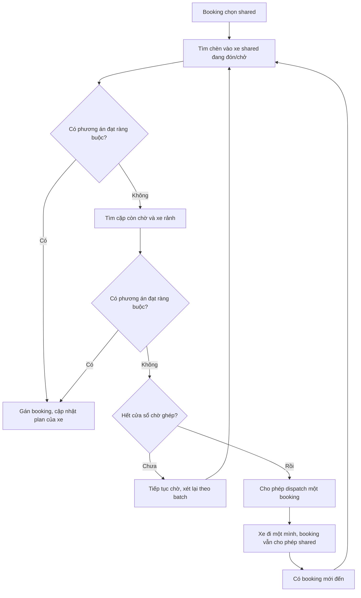

# Nghiên cứu mở rộng kami: ghép chuyến khi chờ và khi xe đang chạy

| | |
|---|---|
| Ngày khảo sát | 2026-10-09 |
| Trạng thái | Đề xuất nghiên cứu, chưa phải yêu cầu hoặc implementation plan được duyệt |
| Mã nguồn khảo sát | HEAD `002c62c` và working tree hiện tại; có thay đổi Sprint 08/09 chưa commit |
| Phạm vi nghiên cứu | Khách chủ động chọn đi ghép; ghép hai booking còn chờ; xuất phát một mình khi hết cửa sổ chờ; chèn booking mới vào xe đang đón/chở khách |
| Ràng buộc hiện hành | [requirements §5](../requirements.md#5-ngoài-phạm-vi-hiện-tại) và [AGENTS.md](../../AGENTS.md) đang để shared ride ngoài phạm vi 0.2 |
| Tài liệu liên quan | [Agent](../engine/04-agents.md), [matching/pooling](../engine/10-matching-pooling-pricing.md), [network/traffic](../engine/08-network-traffic.md), [giới hạn](../engine/17-limitations-roadmap.md) |

Tài liệu này nghiên cứu hướng mở rộng theo yêu cầu người dùng. Chưa thay đổi requirements, phạm vi/AC sprint,
plan Sprint 09 hoặc code engine. Các kiểu dữ liệu, tham số và tên module mới dưới đây đều là đề xuất.

## 1. Kết luận và hướng đề xuất

Có thể mô phỏng cả hai trường hợp bằng **một bộ lập lộ trình có danh sách điểm đón/trả**.
Booking mới được thử chèn vào phần lộ trình còn lại của xe; nếu không có xe thích hợp thì thử ghép hai booking
còn chờ và gán cho một xe rảnh. Không có phương án ghép sau cửa sổ chờ thì cho phép điều xe phục vụ một mình.

Nên bắt đầu với:

- Ô tô; chỉ ghép **hai chuyến**, mỗi chuyến được coi là **một người** theo xác nhận của người dùng ngày 2026-10-09. Chưa mô hình hóa nhóm nhiều người trong một chuyến.
- Khách chọn sản phẩm đi ghép ngay lúc đặt; khách chọn đi riêng không được đưa vào tìm kiếm.
- Điểm đến gần nhau là bộ lọc cấu hình được, ví dụ 500 m; mọi phương án vẫn phải qua kiểm tra tuyến đường.
- Đón/trả tại điểm riêng của từng booking. Đi bộ tới điểm chung là một biến thể khác, chưa cần ở bản đầu.
- Cửa sổ chờ ghép hữu hạn; sau đó xe có thể xuất phát với một booking nhưng vẫn nhận thêm khách đã chọn đi ghép.
- Dùng thuật toán **chèn điểm đón/trả có kiểm tra ràng buộc** làm bản nền; so sánh với tối ưu batch sau khi có số liệu.

Thứ tự làm hợp lý: ghép trước khi lên xe → xử lý chuyển sang phục vụ một mình → ghép trên đường →
đo hiệu năng và chất lượng → cân nhắc tối ưu batch. Đây là các giai đoạn đề xuất, chưa tự gán vào sprint hiện có.

## 2. Làm rõ sản phẩm để mô phỏng đúng

### 2.1. “Đi một mình” sau timeout vẫn có thể là sản phẩm đi ghép

Cần tách ba thuộc tính:

| Thuộc tính | Ví dụ |
|---|---|
| Sản phẩm/đồng ý của khách | `exclusive` hoặc `shared` |
| Trạng thái phục vụ | WAITING, MATCHED, ONBOARD, DONE… |
| Thực tế đã đi chung chưa | Có khoảng thời gian trên xe chồng lấn với booking khác hay chưa |

Nếu A chọn shared, chờ hết cửa sổ và được xe đón một mình, A vẫn có thể đồng ý cho B lên sau.
Đó là **booking đi ghép đang được phục vụ một mình**, chưa phải chuyển sang dịch vụ độc quyền.
Nếu thực sự chuyển A sang exclusive thì không được chèn B nữa.

`pooled=True` hiện tại không đủ biểu diễn ba ý này. Cũng không nên dùng `pool_willingness` làm thay thế
cho lựa chọn sản phẩm: mức sẵn lòng và sự đồng ý ở một booking là hai thông tin khác nhau.

Đề xuất mặc định nghiên cứu: đồng ý đi ghép có hiệu lực suốt booking, trong giới hạn đã báo trước;
không hỏi lại và rút ngẫu nhiên lại ở mỗi lần thử một đối tác. Nếu cần mô phỏng khách từ chối đề xuất cụ thể,
đó phải là một điểm quyết định riêng có điều kiện và khóa CRN ổn định.

### 2.2. Ba đồng hồ khác nhau

| Đồng hồ | Mục đích | Hành vi khi hết hạn |
|---|---|---|
| Cửa sổ chờ tìm bạn ghép `pool_hold_s` | Chủ động chờ thêm để tăng cơ hội ghép | Bắt đầu cho phép dispatch một booking |
| Hạn đón `max_pickup_wait_s` | Giới hạn tổng thời gian từ đặt tới được đón | Không nhận phương án dự kiến đón quá hạn |
| Hạn đến nơi/độ vòng | Bảo vệ khách đã được nhận và khách trên xe | Không chèn thêm nếu làm vi phạm cam kết |

Hết cửa sổ ghép không đảm bảo có xe rảnh ngay. A có thể phải tiếp tục chờ xe hoặc hủy theo behavior.
Không đặt lại đồng hồ chờ khi ghép, đổi xe hoặc fallback. Cửa sổ chờ phải nhỏ hơn hạn đón và để lại thời gian
cho xe tới đón.

### 2.3. Điểm đến gần nhau không đồng nghĩa với một điểm trả

A và B có điểm đến cách nhau 300 m có thể được trả ở hai địa chỉ khác nhau.
Một con sông, đường một chiều hoặc lối vào khu đô thị có thể làm quãng đường lái giữa hai điểm lớn hơn nhiều.

Có hai biến thể đáng so sánh:

- **Nhóm điểm đến gần nhau:** chỉ ghép nếu khoảng cách điểm đến nằm trong ngưỡng; sát với ý tưởng ban đầu.
- **Tương thích lộ trình:** cho phép điểm đến xa nhau nếu B ở dọc đường A và giới hạn chất lượng vẫn đạt.

Bản đầu có thể dùng biến thể thứ nhất, đồng thời giữ bán kính thành tham số.
Ngưỡng điểm đến không phải điều kiện toán học bắt buộc của ghép chuyến; ngưỡng nhỏ sẽ bỏ lỡ một số chuyến tiện đường.
Không bắt khách đi bộ chỉ vì hai điểm trả gần nhau. Muốn có điểm đón/trả chung cần thêm mạng đi bộ,
thời điểm khách sẵn sàng ở điểm đón và giới hạn quãng đường đi bộ.

## 3. Hiện trạng trong kami

Đối chiếu trực tiếp code trong working tree:

| Thành phần | Đã có | Khoảng trống so với yêu cầu mới |
|---|---|---|
| [agents.py](../../kami/core/agents.py) | `Stop`, `Driver.plan`, `Driver.onboard`, `capacity`, `plan_version`; Job chứa nhiều rider | Cần lựa chọn shared/exclusive, giới hạn hai chuyến, hạn đón/trả và lịch sử đồng hành; bản này coi một rider là một người |
| [pooling.py](../../kami/pooling.py) | `evaluate`, `best_insertion`, `plan_pair`, `driver_plan_with` | Chưa kiểm tra đầy đủ wait, sức chứa theo từng đoạn, sản phẩm, fleet, pin, ca và cam kết |
| [matching.py](../../kami/matching.py) | Lọc ứng viên, many-to-one ETA, greedy/Hungarian | Chủ yếu gán job mở với xe rảnh; chưa tối ưu đồng thời nhóm khách, xe bận và tuyến |
| [engine.py](../../kami/core/engine.py) | `assign`, `merge_jobs`, ngắt chặng, đổi plan, loại event cũ bằng version | `merge_jobs` chỉ chấp nhận WAITING + WAITING/MATCHED; loại ONBOARD |
| [policy/library.py](../../kami/policy/library.py) | `PoolAfterWait` đề xuất ghép sau thời gian chờ, hai khách trả lời qua behavior | Khác sản phẩm opt-in từ đầu; matching thường vẫn chạy trong lúc chờ; không phải cơ chế giữ cửa sổ rồi fallback |
| [traffic.py](../../kami/traffic.py) | ETA, tuyến đường, nhóm xe, giao thông, sự cố, cache | Cần truyền nhóm xe vào mọi đánh giá; ETA của plan là dự đoán, không phải bảo đảm thời gian thực tế |
| [metrics.py](../../kami/metrics.py) | `pool_*`, detour, vehicle-km, thu nhập | Chưa phân biệt opt-in, được ghép và thực sự cùng có mặt trên xe; một số chỉ số dùng direct distance |
| Cấu hình/service/UI/replay | Có snapshot run, cấu hình fleet, lưu metric và phát lại quỹ đạo | Chưa có sản phẩm shared hoặc dữ liệu đầy đủ cho nhiều booking trên một xe |

Các điểm cần lưu ý trước khi tái sử dụng ý tưởng cũ:

1. `find_partner(include_matched=True)` chỉ thêm khách MATCHED, không tìm ONBOARD.
   `driver_plan_with` có tham số thời điểm đã đón nhưng API ghép không mở đường cho trường hợp ONBOARD.
2. `plan_pair(a,b)` bắt đầu ở origin của A, trước khi biết xe thực sự ở đâu.
   Ghép cặp hợp lệ ở đó chưa đủ đảm bảo hạn đón/trả sau khi thêm quãng đường xe đến.
3. `find_partner` trả ứng viên khả thi đầu tiên theo khoảng cách thô, chưa chọn phương án tốt nhất trên toàn bộ xe/khách.
4. `evaluate` gọi `traffic.estimate` không truyền group của xe.
5. Giới hạn cũ là `direct_tt * (1 + ratio) + abs`: mặc định cho phép **50% cộng thêm 300 giây**.
   Đây không phải “tối đa 50% hoặc 5 phút, lấy mức nhỏ hơn”; dùng lại sẽ cho phép vòng nhiều hơn cách diễn giải đó.
6. Sức chứa cũ đếm số booking trên xe/còn đón. Với giả định mỗi chuyến là một người, cách đếm này đủ cho
   cặp hai chuyến có chồng lấn, nhưng vẫn cần giới hạn riêng hai chuyến thay vì cho ghép tới capacity xe.
7. Vị trí xe hiện tại được quy về một node đã đi qua, còn distance của chặng dở tính theo tỷ lệ thời gian.
   Với ghép trên đường, cần giải quyết nhất quán phần cạnh còn lại; nếu đổi tuyến từ node phía sau sẽ có sai lệch vị trí/khoảng cách.
8. Engine đang dùng `Leg.t_depart` ở tương lai để biểu diễn thời gian lên/xuống xe.
   Đổi plan trong khoảng đó cần giữ phần thời gian phục vụ còn lại, tránh cho xe đi ngay.
9. Chưa có mô phỏng SOC/sạc hoàn chỉnh: `range_km` hiện được lưu, `CHARGING` và event sạc vẫn là phần dành sẵn.
   Không coi điều kiện đủ pin đã được engine bảo đảm.
10. Cờ pooled có thể tồn tại dù đối tác hủy trước khi lên xe. Hai booking được phục vụ tuần tự cũng không phải đi chung.

**Kiểm chứng hiện trạng:** chạy `python -X utf8 -m unittest tests.test_policy_pooling` ngày khảo sát:
6/6 test đạt, thời gian unittest 5,331 giây. Môi trường có cảnh báo NumPy 2.4.3 ngoài khoảng hỗ trợ của SciPy đang dùng.
Đây chỉ là kiểm tra pooling/policy cũ; chưa có benchmark hay chứng minh ghép ONBOARD hoạt động.
Không sửa dependency để thực hiện nghiên cứu.

### 3.1. Giải thích giới hạn hiện tại

`WAITING` là khách đã đặt nhưng chưa được gán tài xế; `MATCHED` là đã có tài xế đang tới đón, khách chưa lên xe;
`ONBOARD` là khách đã lên xe. Code `merge_jobs` hiện chỉ cho WAITING + WAITING hoặc WAITING + MATCHED.
Vì vậy xe đang chạy tới đón A có thể được chèn B, còn xe đã chở A thì API này từ chối ghép B.
Đây là giới hạn của code hiện tại, không phải giới hạn của thuật toán hoặc hành vi mong muốn.

`plan_pair` không yêu cầu mọi xe/khách đứng yên. Nó lập tuyến cho hai khách chưa gán xe và giả định điểm xuất phát
là origin của A, nên chưa biết quãng đường xe thực tế phải tới đón. `driver_plan_with` đã có ý tưởng lập lại plan
từ vị trí xe hiện tại và thời điểm đã đón khách. Phần tìm kiếm/commit và xử lý di chuyển cần mở rộng để nối
được ý tưởng đó vào trường hợp ONBOARD một cách nhất quán.

## 4. Cơ sở thuật toán và lựa chọn

| Hướng | Phù hợp | Đánh đổi cho kami |
|---|---|---|
| Ghép cặp theo đồ thị tương thích | Hai booking còn chờ; ước lượng tiềm năng ghép | Ghép cặp trước rồi mới tìm xe có thể bỏ lỡ tính khả thi theo vị trí xe |
| Chèn pickup/dropoff | Online, xe rảnh hoặc có plan, giới hạn hai booking | Dễ làm bản nền và kiểm tra; quyết định greedy có thể kém ở quy mô đội xe |
| Sinh nhóm khả thi rồi gán nhóm–xe | Tối ưu nhiều booking/xe theo batch | Cần sinh ứng viên, ràng buộc chống dùng trùng request và solver lớn hơn |
| Điều chỉnh thời gian chờ thích nghi | Demand không đều theo vùng/giờ | Cần dữ liệu và benchmark bản nền trước khi thêm mô hình dự báo/học |

Santi và cộng sự xây dựng đồ thị các chuyến có thể chia sẻ và dùng matching để chọn cặp.
Nghiên cứu cũng phân biệt trường hợp biết trước demand với online, điều phù hợp khi kiểm tra simulator có dùng
thông tin tương lai hay không. [Bài báo Santi et al., 2014](https://arxiv.org/html/1310.2963).

MATSim DRT mô tả insertion heuristic, kiểm tra capacity, thời gian xe hoạt động, wait và travel time cho cả
khách mới lẫn khách đã nhận. Đây là nguồn tham khảo trực tiếp cho bộ kiểm tra tính khả thi.
Lưu ý travel-time bound trong tài liệu MATSim bao gồm thời gian chờ; không bê nguyên tên tham số sang ràng buộc
in-vehicle của kami. [Tài liệu chính thức MATSim DRT](https://raw.githubusercontent.com/matsim-org/matsim-maas/master/drt.md).

Alonso-Mora và cộng sự sinh nhóm khả thi rồi dùng bài toán nguyên để gán nhóm cho xe; phương pháp hỗ trợ
ghép vào chuyến đang có. Tính tối ưu phụ thuộc vào mức độ duyệt nhóm và giải bài toán; giới hạn ứng viên
hoặc dừng sớm làm giảm bảo đảm đó. [Bài báo Alonso-Mora et al., 2017](https://people.csail.mit.edu/jalonsom/docs/17-alonsomora-ridesharing-pnas.pdf).

Có nghiên cứu so sánh insertion đơn giản và thuật toán nhiều bước, cho thấy chất lượng và chi phí tính toán
cần được đo cùng nhau. Chưa có cơ sở chọn solver nặng chỉ từ quy mô mục tiêu của kami.
[Engelhardt et al., 2020](https://arxiv.org/abs/2007.14877).

WATTER nghiên cứu việc chờ thêm để đổi lấy nhóm ghép tốt hơn. Đây là hướng mở rộng cho timeout thích nghi
sau khi có bản dùng ngưỡng cố định và dữ liệu; chưa cần đưa mô hình học vào bản đầu.
[Zhong et al., 2024](https://arxiv.org/abs/2403.11099).

Các kết quả tiết kiệm/đáp ứng demand ở thành phố khác không phải dự báo cho Hà Nội.
Nếu tham khảo số liệu Alonso-Mora, cần dùng cả bản đính chính các hình/bảng quãng đường:
[Correction, 2018](https://pmc.ncbi.nlm.nih.gov/articles/PMC5777016/).

## 5. Thuật toán đề xuất cho hai booking

### 5.1. Lọc ứng viên

Với booking B mới hoặc còn chờ:

1. B phải chọn shared; loại terminal request, xe không đúng sản phẩm/fleet, xe offline/đang sạc và xe không được nhận thêm.
2. Tìm xe có một booking shared đang MATCHED hoặc ONBOARD trong vùng có khả năng đến đón B kịp.
3. Tìm booking shared còn chờ có điểm đón/điểm đến tương thích, và xe rảnh có thể phục vụ.
4. Lọc rẻ bằng index không gian/nhóm điểm đến; tính ETA trên mạng đường cho tập ứng viên còn lại.
5. Giới hạn số ứng viên theo tham số, có ghi nhận số lần bị cắt để biết tác động lên chất lượng.

Bán kính điểm đón chỉ là một cách lọc; với xe đang chạy cần xét vị trí **hiện tại của xe**,
không chỉ khoảng cách giữa origin ban đầu của A và B. Hai origin xa nhau vẫn có thể ghép khi xe đã tới gần B.

Bộ lọc theo hướng/điểm đến có thể bỏ lỡ phương án tốt. Phân biệt bộ lọc là định nghĩa sản phẩm
(ví dụ bắt buộc điểm đến gần) với heuristic cắt giảm tìm kiếm. Nếu dùng khoảng cách chim bay làm
lower bound ETA thì tốc độ tối đa phải là cận trên hợp lệ.

### 5.1.1. Tìm ứng viên theo hướng người dùng mô tả

Khi B đặt chuyến, tìm các chuyến shared A có điểm đến gần điểm đến B, chưa ghép với chuyến thứ hai.
Sau đó xét **phần lộ trình xe còn phải đi**, từ vị trí hiện tại: điểm đón B có gần phần đường này không,
hoặc xe phải vòng thêm bao nhiêu để tới đón B. Không xét phần đường xe đã đi qua như cơ hội đón còn lại.

Khoảng cách tới tuyến giúp xếp hạng/lọc rẻ, còn quyết định cuối cùng dựa trên thử chèn pickup/dropoff trên mạng đường.
B ở gần đường chưa chắc đón được nhanh: có thể nằm phía đối diện đường một chiều hoặc xe đã đi qua lối vào.
Ngược lại, B hơi xa tuyến vẫn có thể ghép nếu quãng đường vòng thêm nhỏ và đáp ứng ràng buộc.
Không bắt buộc B nằm sát đường cũ; bộ lọc phải đủ rộng để giữ các phương án đi vòng còn chấp nhận được.

Với mỗi ứng viên, ghi riêng:

```text
added_delay_A = predicted_dropoff_A_new - predicted_dropoff_A_existing_plan
added_vehicle_time = remaining_plan_time_new - remaining_plan_time_existing
extra_ride_B = predicted_in_vehicle_B - direct_service_time_B
```

Hai plan để tính chênh lệch A/xe dùng cùng vị trí hiện tại và snapshot traffic. Kiểm tra thêm thời gian B chờ được đón
và độ vòng tích lũy của A so với cam kết ban đầu; chỉ xét chênh lệch lần chèn mới sẽ cho phép trễ cộng dồn.
Chọn phương án tốt nhất trong các ứng viên đạt giới hạn, cập nhật tuyến từ vị trí xe hiện tại.
Không có ứng viên đạt thì quay về ghép với khách còn chờ hoặc phục vụ B một mình theo timeout của B.

### 5.2. Hai booking chưa lên xe

Gọi P_A/P_B là pickup và D_A/D_B là dropoff. Có sáu thứ tự thỏa pickup trước dropoff;
**bốn thứ tự có thời gian trên xe chồng lấn**:

```text
P_A → P_B → D_A → D_B
P_A → P_B → D_B → D_A
P_B → P_A → D_A → D_B
P_B → P_A → D_B → D_A
```

Hai thứ tự P_A → D_A → P_B → D_B và ngược lại chỉ là phục vụ tuần tự.
Không tính chúng là một cặp ghép chuyến.

Với mỗi xe v, bắt đầu từ vị trí và thời điểm khả dụng thực sự của v, chạy thử bốn thứ tự.
Mỗi đoạn dùng router theo nhóm xe và góc nhìn giao thông của nền tảng; cộng thời gian lên/xuống.
Giữ phương án đạt ràng buộc và có điểm số tốt nhất. Không cố định “A đặt trước nên đón A trước”;
A đặt trước được bảo vệ bằng deadline và trọng số chờ.

Nếu A đã MATCHED nhưng chưa lên xe, vẫn có thể thử thứ tự điểm đón mới nếu cam kết A còn đạt.
Bản đầu nên giữ nguyên xe đã gán, tránh thêm bài toán chuyển A sang tài xế khác.

### 5.3. A đã ONBOARD, B đặt sau

Với A đã ở trên xe và chưa có booking thứ hai, có hai thứ tự ghép thực sự:

```text
vị trí xe hiện tại → P_B → D_A → D_B
vị trí xe hiện tại → P_B → D_B → D_A
```

Phương án D_A → P_B → D_B không chồng lấn, chỉ là chuyến kế tiếp.

Chạy thử từ trạng thái xe thực tế: người đang trên xe, thời điểm đã đón A, phần cạnh đang đi,
thời gian phục vụ tại stop chưa xong và các deadline đã cam kết.
Độ vòng A phải tính trên **toàn bộ thời gian A ở trên xe**, không chỉ phần còn lại.
Sau mỗi lần chèn không được đặt lại hạn trễ của A.

Nếu cả hai thứ tự không đạt, không chèn B vào xe A. B tiếp tục tìm bạn ghép/xe khác;
hết cửa sổ chờ riêng của B thì được xét phục vụ một mình.

### 5.4. Kiểm tra tính khả thi

Một bộ kiểm tra dùng chung cho cả ba trạng thái: chưa gán xe, đang tới đón, đã chở khách.

| Điều kiện | Cách kiểm tra đề xuất |
|---|---|
| Đồng ý và sản phẩm | Tất cả booking đang hoạt động trên xe đều shared; đúng sản phẩm/fleet |
| Thứ tự | Mỗi booking chưa lên xe có đúng một pickup trước một dropoff; khách onboard chỉ có dropoff còn lại |
| Số booking | Không vượt hai booking active trong bản đầu |
| Số người | Mỗi chuyến là một người; chỉ ghép hai chuyến trên ô tô có capacity hành khách ít nhất hai |
| Hạn đón | pickup_i ≤ booked_i + max_pickup_wait_i, đồng thời giữ cam kết pickup_i đã báo |
| Thời gian trên xe | Thời điểm trả trừ thời điểm đón thật/dự kiến không vượt giới hạn đã thống nhất |
| Hạn đến nơi | Không vượt latest_dropoff nếu sản phẩm đã cam kết mốc này |
| Ca và pin | Lộ trình còn lại phù hợp quy tắc kết ca; khi EV có thật, đủ pin cho tuyến và phần dự phòng tới sạc |
| Tuyến hợp lệ | Đường có hướng, hạn chế theo nhóm xe; reject đoạn không tới được |
| Chất lượng ghép | Có chồng lấn onboard; cân nhắc ngưỡng chồng lấn tối thiểu, tránh ghép chỉ vài giây |

Đề xuất thử nghiệm giới hạn độ vòng theo **đồng thời hai cận**:

```text
allowed_extra_i = min(detour_abs_s, detour_ratio * direct_drive_tt_i)
in_vehicle_i ≤ boarding_s_i + direct_drive_tt_i + allowed_extra_i
```

Đây là lựa chọn sản phẩm đề xuất, khác công thức cộng hai mức của pooling cũ.
`direct_drive_tt_i` là thời gian lái trực tiếp theo baseline đã xác định và lưu lại; không tái đặt baseline
mỗi lần chèn để nới giới hạn. Timestamp pickup hiện tại ghi lúc tới điểm đón, nên in_vehicle chứa thời gian
boarding của chính khách; cần cộng khoản này vào baseline để không quy nó thành độ vòng.
Dwell tại các stop trung gian vẫn làm tăng in_vehicle và phải được tính.

Ví dụ đề xuất: A đi trực tiếp 20 phút, cận 20% và 180 giây ⇒ được tăng tối đa 180 giây.
B đi trực tiếp 10 phút ⇒ được tăng tối đa 120 giây.
Có thể thêm cận tổng thời gian từ đặt đến đến nơi để tránh cộng dồn chờ lâu và vòng lâu.

Giao thông thay đổi vẫn có thể làm thực tế quá hạn dù dự đoán lúc nhận đạt. Phải ghi vi phạm và
dừng nhận thêm nếu làm trễ hơn; không sửa mốc cam kết để che vi phạm.
Ở bản đầu nên công bố ETA theo snapshot traffic tại thời điểm dispatch, phù hợp giới hạn engine;
dự báo giao thông theo thời điểm đến từng cạnh là một năng lực bổ sung.

### 5.5. Chọn phương án

Không chỉ chọn đối tác gần nhất hoặc tuyến ngắn nhất: tuyến ngắn có thể khiến một khách chờ quá lâu.
Có thể dùng điểm số quy đổi về cùng đơn vị:

```text
cost =
    cost_per_vehicle_s * added_vehicle_seconds
  + cost_per_vehicle_m * added_vehicle_metres
  + value_of_wait_s * sum(wait_seconds)
  + value_of_delay_s * sum(extra_in_vehicle_seconds)
  - service_reward_per_booking * newly_served_bookings
```

Các hệ số có đơn vị VND/giây, VND/mét hoặc VND/booking. Không cộng thẳng mét, giây, VND.
Định nghĩa baseline cho added_vehicle_* phải thống nhất giữa các ứng viên. Khi chèn B vào xe có A,
baseline là plan còn lại của xe đó; khi so với phục vụ riêng cần tính cả xe/đường đón B của phương án riêng.

Có thể dùng thứ tự ưu tiên “phục vụ nhiều booking hơn, rồi giảm cost” thay cho reward khó hiệu chỉnh.
Cam kết và sức chứa luôn là ràng buộc cứng; ưu tiên phục vụ không được ghi đè chúng.

Nếu muốn chỉ nhận cặp có lợi về vehicle-km, cần so với **hai phương án đi riêng khả thi** trong cùng snapshot,
bao gồm km xe chạy tới đón. Không dùng mỗi tổng khoảng cách trực tiếp của khách làm baseline vận hành.

Với bản greedy: ưu tiên booking gần hết hạn, sau đó thời điểm đặt và ID; so các phương án khả thi,
commit một phương án rồi cập nhật ứng viên liên quan. Tie-break bằng ID xe/booking và thứ tự stop để tái lập.

### 5.6. Vì sao Hungarian hiện tại chưa giải được toàn bộ

Nếu một “job cặp” AB và job AC cùng xuất hiện như hai hàng độc lập, Hungarian có thể gán cả hai cho hai xe:
A bị phục vụ hai lần. Cần ràng buộc **mỗi booking tối đa một phương án**, không chỉ mỗi job một xe.

Hai lựa chọn:

- Bản nền: chọn cặp không trùng booking trước, sau đó gán xe; đánh giá plan lại theo xe cụ thể.
  Hoặc greedy trực tiếp trên các phương án (xe, tập booking, plan), cập nhật sau mỗi commit.
- Bản batch: sinh các phương án một/hai booking cho xe; chọn bằng bài toán set packing/ILP,
  với mỗi xe tối đa một plan và mỗi booking mới tối đa một phương án. Booking đang chở phải được giữ;
  xe có khách phải có cả lựa chọn giữ nguyên plan để solver không “bỏ” khách.

Tối ưu batch không tự bảo đảm tối ưu cả ngày; nó tối ưu trong các phương án và thông tin hiện tại.
Không dùng yêu cầu chưa đến làm đầu vào của thuật toán online. Có thể dùng replay tương lai cho
một benchmark biết trước riêng, phải ghi nhãn rõ.

## 6. Luồng sự kiện đề xuất



Sơ đồ mô tả một thứ tự xử lý dễ làm bản nền. Khi đã sinh được nhiều loại ứng viên, có thể so điểm số
ghép vào xe bận, ghép cặp chờ và đi một mình trong cùng batch, thay vì luôn ưu tiên xe bận.

Mỗi batch:

1. Chụp trạng thái sau các event môi trường, đến stop, hủy và demand ở thời điểm hiện tại.
2. Sinh phương án cho booking shared còn chờ, chỉ dùng thông tin đã xuất hiện.
3. Chọn phương án không dùng trùng booking/xe và vẫn giữ khách đã nhận.
4. Kiểm tra lại version, trạng thái, pin/tải và deadline trước khi commit.
5. Engine cập nhật toàn bộ liên kết rider/job/driver và plan cùng một giao dịch logic.
6. Ghi sự kiện, hủy hiệu lực event đến stop cũ, tạo event mới, cập nhật index và cancellation hazard.

Khi hết `pool_hold_s`, chỉ mở quyền dispatch một booking nếu chưa gán; không tạo job thứ hai,
không đổi sản phẩm và không làm mất thời gian đã chờ. Dùng timer có token/version;
timer đã cũ trở thành no-op. Không trì hoãn fallback thêm một batch dài ngoài cửa sổ đã cấu hình.

Không ép xe đứng chờ tại điểm đón sau khi A đã lên chỉ để tìm B trong bản đầu.
Chỉ đổi tuyến nếu có booking B cụ thể và phương án được chấp nhận.

Thứ tự cùng timestamp phải được chốt và test, đặc biệt pickup/cancel/timeout/dispatch.
Engine hiện có priority và sequence number; có thể mở rộng cơ chế đó, không dựa vào thứ tự duyệt set/dict.
Candidate cache phải mang plan_version và phiên bản traffic, được đánh giá lại nếu trạng thái đổi.

## 7. Thiết kế tích hợp đề xuất

### 7.1. Dữ liệu

| Đối tượng | Dữ liệu cần bổ sung/chuẩn hóa |
|---|---|
| Request/Rider | service_mode, thời hạn giữ/chờ/đến nơi, direct baseline, lựa chọn cho ghép sau fallback; mỗi rider tương ứng một chuyến/một người |
| Quote | Giá đã báo, loại dịch vụ, giới hạn wait/detour và điều kiện fallback |
| Driver/vehicle | Capacity hành khách, danh sách booking active, vị trí trên cạnh hoặc mốc reroute hợp lệ, service_until |
| RoutePlan | Stops, thời điểm dự kiến, tải sau mỗi stop, cost/distance, cam kết, version và trạng thái đầu vào |
| Rider history | Đối tác thực sự đi cùng, khoảng thời gian/quãng đường chồng lấn, lý do fallback |
| Run snapshot | Toàn bộ cấu hình shared, thuật toán, ngưỡng, phiên bản schema và giả định hành vi |

Giữ RiderState hiện có; không cần tạo các trạng thái như “POOLED_ONBOARD” trộn loại dịch vụ vào lifecycle.
Giữ booking độc lập về giá và hủy, xe có plan chung. Cần audit lifecycle Job nếu vẫn dùng một Job chứa nhiều rider:
hủy một booking không được hủy booking kia; Job hoàn tất không đồng nghĩa từng booking hoàn tất cùng lúc.

Nếu sản phẩm thực sự chỉ ghép một cặp, thêm giới hạn số **đối tác khác nhau thực sự đi cùng** mỗi booking bằng 1.
Chỉ giới hạn hai booking đồng thời vẫn cho phép A lần lượt đi cùng B rồi C sau khi B xuống.
Điểm này cần được chốt trước khi mô phỏng bản trên đường.

### 7.2. Phân chia trách nhiệm

- Bộ tìm ứng viên: index booking chờ, xe và điểm đến của plan còn lại.
- Bộ đánh giá plan: hàm không làm thay đổi Simulation; kiểm tra thứ tự, tải, ETA, deadline, cost.
- Bộ chọn phương án: greedy hoặc batch solver, tie-break ổn định.
- Engine: kiểm tra lại và commit, xử lý hủy/đón/trả, ngắt chặng, metric và log.
- Pricing/behavior: giá shared và quyết định đặt; dùng CRN ở điểm quyết định.
- Service/UI/replay: cấu hình, snapshot, quan sát nhiều booking trên xe; không tham gia chọn tuyến.

Nên tạo module cho shared dispatch mới sau khi duyệt, lấy ý tưởng insertion và test cases từ code cũ.
Không chỉ bật lại `PoolAfterWait`, không mở lại policy plugin/group/agent.
Thuật toán và tham số shared là cấu hình kịch bản, tương tự hướng matching/pricing của 0.2.
Giữ hành vi mặc định và API 0.1; tránh sửa semantics của các metric/config pooling cũ một cách âm thầm.

### 7.3. Những điểm engine phải làm chắc cho ghép trên đường

- Khi reroute giữa cạnh, đi nốt đoạn cạnh đã cam kết hoặc dùng vị trí trên cạnh có residual time/distance.
  Nếu bản đầu chỉ cho reroute ở node kế tiếp, phải cộng thời gian đi tới node đó và ghi rõ giả định.
- Không được nhảy lùi về node vừa đi qua, sinh distance âm, tính lại distance đã đi hoặc bỏ thời gian boarding.
- Event ARRIVE_STOP cũ phải vô hiệu; booking mới không được đón hai lần hoặc nằm trong cả hàng chờ lẫn xe.
- Khi B hủy trước pickup, bỏ đúng stops của B, giữ A và mốc cam kết; tính lại plan nếu cần.
- Hết ca/traffic change cũng phải kiểm tra trên plan nhiều booking.
- Không dùng `pooled` thay cho occupancy; occupancy phải lấy từ thực tế lên/xuống theo từng thời đoạn.

### 7.4. Giá và hành vi

Đề xuất nghiên cứu ban đầu: báo trước giá shared thấp hơn giá đi riêng tương ứng,
giữ giá đã chấp nhận kể cả khi không tìm được đối tác. Cách này giúp tách thí nghiệm vận hành khỏi
việc khách quyết định lại sau timeout. Nó là giả định cần người dùng chốt, chưa phải quy tắc đã được duyệt.

Phương án khác là chỉ giảm khi thực sự ghép, hoặc báo lại giá khi chuyển exclusive.
Hai phương án đó cần thêm sự kiện báo giá/chấp nhận, hành vi và sổ tiền; không chỉ cập nhật surcharge khi merge.

Khởi đầu có thể gán service_mode từ demand input hoặc tỉ lệ synthetic cố định qua CRN. Mỗi chuyến luôn được coi là một người; chưa cần trường party_size.
So sánh thuật toán bằng cùng OD/thời điểm/opt-in/seed và khóa ngẫu nhiên theo booking.
Khi đánh giá thị trường có phản ứng với giá/wait, bật behavior đặt/hủy và báo riêng hiệu ứng lựa chọn dịch vụ.
Không dùng số lần duyệt ứng viên của solver làm khóa CRN.

## 8. Hiệu năng ở quy mô kami

Mục tiêu hiện hành khoảng 100.000 request/ngày và 8.000 xe. Nếu quét mọi xe cho mỗi request thì riêng
bước lọc đã có thể đạt 800 triệu lượt kiểm tra, chưa tính insertion/routing. Đây là phép tính quy mô,
không phải benchmark của máy hiện tại.

Với m stop còn lại có O(m²) vị trí chèn pickup/dropoff; đánh giá lại cả tuyến mỗi lần tốn O(m),
tức O(m³) lượt xử lý đoạn theo cách đơn giản, ngoài chi phí router.
Giới hạn hai booking giúp m nhỏ; điểm nghẽn dễ là số xe/booking ứng viên và số truy vấn mạng đường.

Đề xuất:

- Index không gian động cho xe và booking chờ; index điểm đến cho booking/plan active.
- Dùng ETA lower bound và sức chứa/deadline để loại trước truy vấn tuyến.
- Đặt số ứng viên cố định, không cắt theo wall-clock nếu cần kết quả tái lập tuyệt đối.
- Cache theo origin/destination, group, trạng thái traffic và thời gian thích hợp; invalidation rõ khi giao thông đổi.
- Với code hiện tại, không gọi apply_period cho thời gian tương lai trong lúc chạy thử plan vì nó đổi thế giới thật.
- Chỉ lấy path chi tiết của phương án được chọn; ưu tiên cost/ETA queries khi đánh giá.
- Batch nhỏ, thử các cửa sổ 5/10/20 giây; timeout fallback riêng.
- Đo router Python/C++ riêng. Không coi có router C++ là đủ bảo đảm mục tiêu 30 phút/ngày.
- Chia vùng tính toán nếu cần, nhưng phải có vùng đệm để không mất cặp ở biên.

Cắt ứng viên có thể làm xấu chất lượng. Trên bài nhỏ phải so với duyệt đầy đủ để đo tỉ lệ bỏ lỡ.
Nếu dùng solver có timeout theo thời gian máy, cần chốt yêu cầu determinism và lưu cấu hình solver;
bản nền nên dùng ngân sách duyệt cố định và thứ tự ổn định.

Không có số đo hiệu năng shared mới trong nghiên cứu này. Mốc không-pooling cần lấy từ backlog/benchmark
gần nhất khi triển khai, giữ ngưỡng thoái lui 10% của AGENTS.md hoặc ghi rõ chi phí tính năng được duyệt.

## 9. Bộ thí nghiệm và kiểm chứng cần có khi triển khai

### 9.1. Ca kiểm chứng chức năng

| Ca | Kết quả cần quan sát |
|---|---|
| A/B cùng shared, cùng hướng, còn chờ | Cùng xe, đúng thứ tự tốt nhất trong bốn tuyến, không dùng trùng booking |
| Xe gần B hơn A | Có thể đón B trước; không mặc định theo người đặt trước |
| Gần điểm đến nhưng cách sông/đường một chiều | Lọc thô không làm bỏ qua tính khả thi đường thật |
| Khách exclusive ở gần | Không bao giờ ghép vào xe/chuyến exclusive |
| Không có B trước timeout | A được quyền dispatch một mình; không đổi booked_t/service_mode |
| Timeout nhưng không có xe | Không giả định A đã được đón; cancellation vẫn chạy |
| A ONBOARD, B đặt sau | Chọn đúng một trong hai thứ tự feasible, tính cả thời gian A đã ngồi |
| B làm A quá deadline | Reject insertion; A tiếp tục, B tìm phương án khác |
| Xe đã có hai chuyến active hoặc không đủ hai chỗ hành khách | Không nhận chuyến thứ ba; không ghép trên xe không phù hợp |
| B hủy sau ghép trước khi đón | B ra khỏi plan; A vẫn được phục vụ; không tính overlap giả |
| Đón/trả tuần tự | Không tính là actual shared |
| Xe giữa cạnh/đang boarding | Không teleport, không tính km hai lần, không bỏ dwell |
| Pickup/cancel/timeout cùng timestamp | Kết quả đúng quy tắc ưu tiên và lặp lại được |
| Traffic thay đổi sau ghép | Ghi forecast error/vi phạm thực tế; không nới cam kết âm thầm |
| Xe kết ca hoặc thiếu pin | Áp dụng đúng quy tắc ca và điều kiện EV đã hiện thực |
| Cùng cấu hình + seed | Log/metric giống nhau qua nhiều lần chạy |
| Shared tắt | API/CLI/ví dụ 0.1 và baseline 0.2 tiếp tục chạy |
| Cặp AB/AC cạnh tranh hai xe | A không bị gán hai lần |
| B xuống rồi C đặt khi A còn trên xe | Đúng quy tắc một đối tác hoặc cho phép chuỗi đã chọn |

Dùng mạng nhỏ có hướng, travel time biết trước để duyệt toàn bộ thứ tự làm oracle.
Tách test cho evaluator thuần và test tích hợp event/state; test tổng hợp “có pooled rider” không đủ.

### 9.2. Ma trận so sánh

Cùng demand/seed, đo ít nhất:

1. Không cho ghép.
2. Chỉ ghép khi còn chờ/chưa lên xe.
3. Trường hợp 2 + ghép vào xe đang chở.
4. Trường hợp 3 + lựa chọn batch nâng cao nếu được triển khai.

Tách hai loại đánh giá: vận hành với demand/opt-in cố định và thị trường có booking/cancel phản ứng.
Không lấy ít km do phục vụ ít khách hơn làm bằng chứng cải thiện.

Tham số khảo sát ban đầu, **chưa phải mặc định đã chốt**:

| Tham số | Giá trị thử |
|---|---|
| Tỉ lệ booking chọn shared | 10%, 30%, 50% |
| Cửa sổ chờ ghép | 0, 30, 60, 120 giây |
| Hạn đón tổng | 180, 300, 600 giây; loại cấu hình không phù hợp cửa sổ giữ |
| Bán kính điểm đến | 300, 500, 800 m; thêm đối chứng tương thích tuyến không giới hạn điểm đến |
| Cận tương đối/ tuyệt đối độ vòng | 10/20/30% và 120/180/300 giây; dùng quy tắc min đã nêu |
| Số booking active tối đa | 2 |
| Giảm giá shared | 10%, 20%, 30%; chỉ là giả định mô phỏng |
| Loại demand | Thưa, cao điểm, tập trung cùng điểm đến, phân tán |

Không cần chạy tích Descartes của mọi giá trị ngay: chọn kịch bản đại diện, thay từng nhóm yếu tố,
sau đó xác nhận tổ hợp tốt bằng nhiều seed và paired comparison/CI.

### 9.3. Metric phải phân biệt rõ

- **Opt-in share:** số booking chọn shared / số booking, theo cùng cohort.
- **Actual share rate:** số booking hoàn tất có thời gian onboard chồng lấn > 0 / số shared booking hoàn tất;
  báo thêm tỷ lệ trên toàn bộ booking hoàn tất.
- **Fallback rate:** booking shared được dispatch một mình vì hết cửa sổ / shared booking được nhận;
  báo riêng nhóm sau fallback vẫn ghép được.
- **Wait/detour:** p50/p90/p95 và tỷ lệ vi phạm, theo từng khách, không chỉ trung bình cả xe.
- **Overlap:** giây/km đi chung; số đối tác mỗi booking; phân biệt chỉ vài giây chồng lấn.
- **Occupancy:** passenger-seconds / thời gian hoạt động của xe; thêm passenger-km thực tế / vehicle-km.
  Với mỗi chuyến là một người, tính theo số rider onboard trên từng đoạn; không lấy direct OD distance thay cho quãng đường thực sự trên xe.
- **Vận hành/kinh tế:** tỷ lệ đáp ứng, hủy, vehicle-km rỗng/có khách/tổng, năng lượng khi EV có thật,
  tổng tiền khách trả, payout tài xế, revenue/trợ giá và chi phí vận hành theo mô hình đã chốt.
- **Thuật toán:** số ứng viên/tuyến/router query, thời gian dispatch, wall-clock cả ngày, RAM,
  tỷ lệ cắt ứng viên và khoảng cách chất lượng so với oracle bài nhỏ.

Báo riêng dự đoán lúc nhận và kết quả thực tế. Không đổi tên hoặc ý nghĩa metric 0.1 hiện có;
thêm metric mới nếu định nghĩa khác.

## 10. Lộ trình đề xuất và các quyết định cần chốt

### Giai đoạn A — nền sản phẩm và ghép trước pickup

Chuẩn hóa service_mode, giả định mỗi chuyến một người, deadline, quote/fallback; tạo evaluator thuần; ghép hai booking
dựa trên xe thật; loại dùng trùng booking; cancellation, metric actual overlap và đối chứng.
Có thể làm engine/library trước UI, vẫn snapshot đầy đủ cấu hình.

### Giai đoạn B — ghép trên đường

Giải quyết vị trí giữa cạnh, dwell còn lại, cumulative detour và plan commitment; tìm xe đang chở;
commit plan có version; audit event/log/trajectory. Chỉ mở sau khi A kiểm chứng tốt.
Nếu chuyển sang B quá sớm, simulator có thể báo tiết kiệm từ lỗi di chuyển hoặc cam kết bị đặt lại.

### Giai đoạn C — tích hợp và tối ưu

Form shared trong kịch bản; backend schema/snapshot; bản đồ hiện nhiều booking/occupancy/stops;
so sánh thuật toán, benchmark 100k request/8k xe và tương tác EV/pricing.
Sau số liệu mới chọn có cần set packing/ILP, ngưỡng chờ thích nghi hay meeting points.

Giả định người dùng đã chốt ngày 2026-10-09: **chỉ ghép hai chuyến, mỗi chuyến là một người**.
Chưa cần mô hình số người thay đổi giữa các chuyến.

Các quyết định sản phẩm còn lại chưa chốt:

| Quyết định | Đề xuất để làm bản đầu |
|---|---|
| Một đối tác duy nhất hay được ghép tiếp sau khi người kia xuống? | Một đối tác thực sự mỗi booking, sát ý tưởng ghép cặp |
| Điểm đến bắt buộc gần nhau? | Có ngưỡng 500 m cấu hình được; so với biến thể tương thích tuyến |
| Khách có phải đi bộ? | Không, mỗi booking có điểm đón/trả riêng |
| Fallback có đổi sang exclusive? | Không; shared còn hiệu lực khi đi một mình |
| Chờ và vòng tối đa? | Thử hold 60 s, wait tổng 300 s, độ vòng min(20%,180 s), rồi đo |
| Giá nếu không ghép được? | Giữ giá shared đã báo; tính chi phí trợ giá rõ |
| Cam kết là hard/soft? | Hard ở bước nhận thêm; báo riêng vi phạm do giao thông thực tế |
| Ghép phải tiết kiệm km hay ưu tiên đáp ứng? | Báo cả hai; chọn mục tiêu trước khi hiệu chỉnh score |

Để bắt đầu implement, cần người dùng chốt phạm vi mở lại shared ride; cập nhật requirements §5,
bối cảnh AGENTS.md và thêm yêu cầu riêng; xác định sprint/phụ thuộc và lập implementation plan theo mẫu.
Không suy ra duyệt triển khai từ yêu cầu nghiên cứu này. Không đưa phần này ngầm vào plan Sprint 09 đã duyệt.

## 11. Lịch sử bổ sung nghiên cứu

- 2026-10-09: giải thích WAITING/MATCHED/ONBOARD và phân biệt hạn chế của API hiện tại với khả năng lập lại lộ trình khi xe đang chạy.
- 2026-10-09: bổ sung luồng tìm ứng viên theo điểm đến, phần tuyến còn lại và thời gian tăng thêm khi đón B.
- 2026-10-09: ghi nhận xác nhận của người dùng: chỉ ghép hai chuyến, mỗi chuyến coi là một người; bỏ yêu cầu mô hình party size biến đổi khỏi đề xuất bản đầu. Không đổi code, requirements hay sprint.
